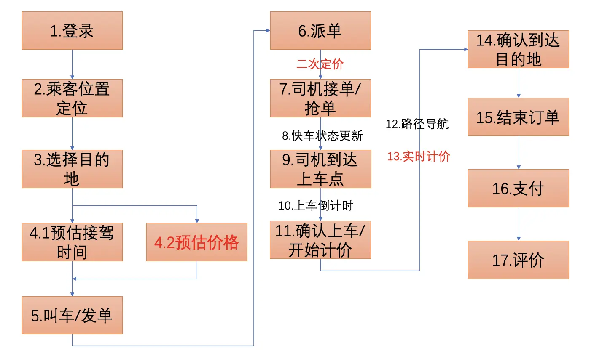
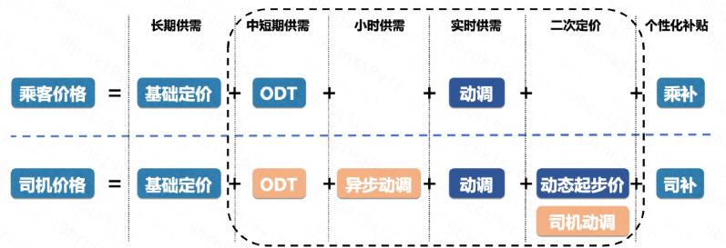
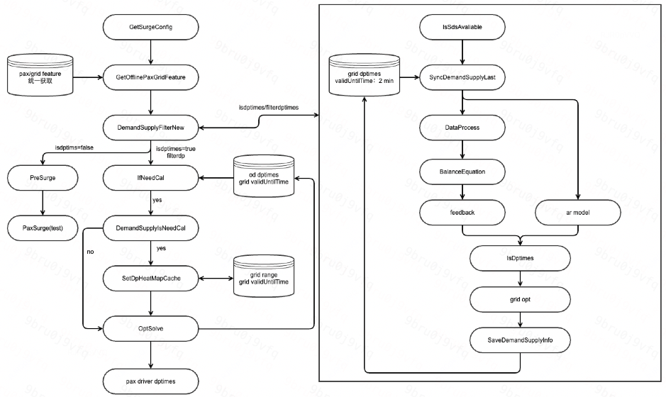
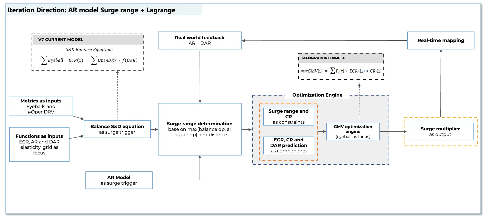

# 2026.07 w2
## 第一天：
熟悉环境，配置code，conda，claude，拉取线上策略代码

## 第二天：通读代码，熟悉逻辑

### 1.线上策略的代码逻辑 <br>
大致逻辑：分单引擎dintl-pricing，在其他服务里通过pricing传参，包括国家、城市等等，在一个循环loopReqItem里，对于每一个订单请求:
- 初始化单个请求的Context，Req、Resp和Trace....其他各种东西。
- 进入 strategy.Process(&ctx)  → process.go ，这里处理各种价格计算，详细见 2 
- 出价格，后续其他

分单引擎，go，总架构如下：<br>
```go

                    ┌──────────────────────┐
                    │   handle/ (入口层)     │  Thrift + HTTP 双协议
                    ├──────────────────────┤
                    │  services/ (编排层)    │  业务流程调度
                    ├──────────────────────┤
                    │  strategy/ (决策引擎)  │  核心定价算法（~99 个策略）
                    ├──────────────────────┤
     ┌──────────────┤  iowrapper/ (IO层)   │  Redis/Fusion/Kafka/MySQL/RPC
     │              ├──────────────────────┤
     │   ┌─────────┤  component/ (适配器)   │  外部服务封装
     │   │         ├──────────────────────┤
     │   │         │  model/ (领域模型)      │  ML 推理 + 数据结构
     │   │         ├──────────────────────┤
     │   │         │  common/ (基础包)       │  Context、常量、接口定义
     │   │         └──────────────────────┘
     │   │
     │   ├─ conf/        运行时配置（Apollo/Redis/MySQL/Kafka）
     │   ├─ data/        模型参数（城市/网格/时段系数）
     │   ├─ idl/         Thrift 接口定义
     │   ├─ docs/        知识库 + 约束文档
     │   ├─ thirdParty/  自建基础库
     │   └─ deploy-meta/ / elevate/  部署和 CR 配置

```

其中和动态定价算法策略相关入口为straegy/dp/dp_8_0.go以及dp_9.0（格子倍数看DemandSupplyFilterV3这版）

和外接线上模型有关服务在model/online_predict.go

动态定价策略现在为dp_9.0，不同的dp策略打包后在引擎中由Process进程调用，process的架构如下（部分cc总结,标了cc的地方我不保真）：

```python
┌──────────────────────────────────────────────────────────────┐
│                    ProcessV2 (strategy/process_v2.go)         │
│  调用 DP Target → DP Follow → ...                             │
├──────────────────────────────────────────────────────────────┤
│  ┌────────────┐  ┌──────────────┐  ┌────────────────────┐   │
│  │ DP 7.x (cc)│  │ DP 8.0(cc)   │  │ DP 9.0 / DPJoint   │   │
│  │ (供需等式) │  │ (拉格朗日)   │  │ (联合优化)         │   │
│  └─────┬──────┘  └──────┬───────┘  └────────┬───────────┘   │
│        │                │                    │                │
│  ┌─────┴────────────────┴────────────────────┴───────────┐   │
│  │              共享核心模块层                             │   │
│  │  demand_supply_filter(_v3/_new)  ← 供需判定 + 基础DP   │   │
│  │  dp_presurge.go                  ← 预调度              │   │
│  │  dp_pid_feedback.go              ← PID反馈控制         │   │
│  │  dp_data_process.go (160KB)      ← 空间平滑 + 数据处理 │   │
│  │  dp_ecr_pred.go / dp_cr_predict  ← 弹性/CR预测模型    │   │
│  └───────────────────────────────────────────────────────┘   │
│        │                                                      │
│  ┌─────┴─────────────────────────────────────────────────┐   │
│  │              子模块目录                                │   │
│  │  paxsurge/     ← 乘客动调（候选生成+预测+最优化）      │   │
│  │  driversurge/  ← 司机动调（触发+预测+热力图+预算控制） │   │
│  │  dp_9_0/       ← DP 9.0 独立包（分层数据+联合优化）   │   │
│  │  common/       ← 共享上下文 DPContext + 工具函数       │   │
│  └───────────────────────────────────────────────────────┘   │
└──────────────────────────────────────────────────────────────┘

```
process内部的逻辑如下（跟着看一遍代码，大哥串讲，补充关键处）： <br>


### 2.打车订单价格逻辑（strategy.process.go的逻辑） <br>

#### 科普 打车全订单流程图 <br>


#### 司机和乘客的定价图 <br>

基本逻辑：司机最终价格和乘客最终价格差值就是赚取的利润。司机价格和乘客价格可以分开计算，这样赚的多些，上图中的基础价由长期供需决定。DP(动态调价)和SP（结构化调价，opt）分别调节短期实时供需和小时级别中期的供需，司机和乘客略有不同，最后加上个性化补贴（发券）。

- DP 动调：根据起点**供需**情况对订单基础费进行倍数调整以调节供需。倍数范围 1.0-5.0  **(我在这里)**（目标 CR GMV，CR体现司乘体验）<br>
   * 异步动调：提前给司机增加动调系数增加高峰期运力。<br>
   * 司乘解耦：司机对动调的响应与乘客有差异，比如预期稳定性。<br>
- SP ODT：根据订单的**起点、终点、时间**对订单价格进行调整（长期结构性调整）。幅度一般在15%以内。（目标 GMV TCH ）
- 二次定价：播单的时候根据司机的接单远近修改司机价格（目标 GMV TCH ）
- 司乘补贴：核心目标是长期留存，不同工具有不同的短期目标。

processv2现在被重构得狠好看了，直接贴代码就能看明白怎么处理的，前半段是读取配置，中间是处理各种品类的定价，后半段是写入log：
```go
func ProcessV2(ctxList []*common.Context) {
	ParallelProcess(ctxList, BeforeProcess)
	//实验
	ExprProcessProxy(ctxList)
	//基础价缓存
	ParallelProcess(ctxList, PreTotalFeeCache)
	//预估价校准、flex基础价修改
	CPProcessProxy(ctxList)

	//动调处理类，我在这里
	DPProcessProxyV2(ctxList)
	//SP-target处理类
	SPProcessTarget(ctxList)
	//价格弹性实验，拼车弹性会另外执行
	RPProcessTarget(ctxList)

	// 预约单：FP 前按系数 N 设 DpTimes=1 / SpTimes=N-1
	ParallelProcess(ctxList, applyReservationCoef)

	//FP-target处理类，不处理sp跟随品类，其他同FPProcessFollow-一口价
	FPProcessTarget(ctxList)
	//SP-follow处理类
	SPProcessFollow(ctxList)
	//RP-follow处理类
	RPProcessFollow(ctxList)
	//品类折扣(PD)系数计算
	PDProcessFollow(ctxList)
	//FP-follow处理类，处理sp跟随品类
	FPProcessFollow(ctxList)
	//特价车处理
	SpecialCarProcessProxyV2(ctxList)

	//通用补贴处理
	CouponProcessProxy(ctxList)

	// 超长距离单倒挂处理

	// 在这里动调倍数-1
	ParallelProcess(ctxList, AfterProcessV2)

    // 这里都是开发要看的（大概）
	//最后写日志和kafka

	return
}
```

### 3. DPProcessProxyV2(ctxList) -> ctx.Custom.DPStrategy.Process(ctx)
DDProcess逻辑：
- 前置处理 beforeDPProcess：从ctx中提取当前策略版本；当上游传解耦标识，且本地Apollo命中解耦，则认为链路中动调解耦、fallback 赋值
- 处理主品类 **dealDPTarget**
    * 如果动调依赖的第三方服务：sds、redis、fusion，三者任一出现降级，则触发动调策略降级
    * 否则执行核心策略：通过sefeDPProcess调用 **ctx.Custom.DPStrategy.Process(ctx)**
    * 若执行失败则执行降级版本，还失败则系数为1 DpTimes=DriDpTimes=1.0
    * 如果司机动调类型为倍数，则执行截断和运营配置的逻辑 TruncateDPTimes
    * 格式化动调位数，设置最小调整单位并处理可能出现的司乘倒挂
    * 如果 DPVersion!="DP_FORCE/DP_SURGE" 或者强制写热力图白名单，则同步动调倍数等信息至SDS
- 处理follow品类 dealDPFollow
- 处理特快费 dealExpressFee

cc总结的此处是如何通过策略版本号调用策略的：
```go
ProcessV2()
  │
  ├─ BeforeProcess()  (line 620-651)
  │    └─ gStrMgr.GetStg(ctx)
  │         └─ GetStgVersion(ctx)  (line 127)
  │              ├─ getStgVersion(ctx)        // 1. 解析出 ctx.Custom.DPVersion = "DP_8_0"
  │              └─ GetDPVersion(ctx)         // 2. new &DP8_0{} 赋给 ctx.Custom.DPStrategy
  │
  └─ DPProcessProxyV2()  (line 944)
       └─ dealDPTarget(ctx)  (line 1159)
            ├─ 检查是否需要降级（SDS/Redis/Fusion 任一故障 → 切 fallbackVersion）
            └─ safeDPProcess(ctx)  (line 1145)
                 └─ ctx.Custom.DPStrategy.Process(ctx)  ← 多态调用，看不懂，能传就行，在这里执行不同版本号dp策略
                      │
                      ├── DP8_0.Process(ctx)    → dp_8_0.go:98
                      ├── DP9_0.Process(ctx)    → dp_9_0/main.go:38
                      ├── DPJoint1_0.Process(ctx) → dpjoint_1_0.go:40
                      ├── DP7_4.Process(ctx)    → dp_7_4.go 内
                      └── ...

```
### 4.DP8_0 策略
DP8_0 struct（line 31-96）有约 65 个字段如下，通过属性方法Process进行：
```go
解耦相关:  DecoupleCoef, DpDecoupleFlag, DriverNoSurgeThreshold
供需相关:  DpCtx (DPContext 上下文), IsOpenDemandSupplyV3
优化相关:  OptTimesStep, EcrModelName/Version, CrModelName/Version
          OptCrTarget, OptECrElasWeight, OptCrElasWeight
          EcrElasMin/Max, CrElasMin/Max
          DpOptRangeMin/Max, DriverDpOptRangeMin/Max
EDA权重:  EdaEcrElasWeightConf, EdaCrElasWeightConf
ESR权重:  EsrEcrElasWeightConf, EsrCrElasWeightConf
模型相关:  UseDeepModel, ModelName/Version, IfSmoothPred
          PaxModelName/Version, ErModelName/Version
乘客动调:  PaxSurgeConfig, DrvSurgeConfig
司机解耦:  DriverIndependentConfig, DriverDecoupledConfig
司机冒泡:  OpenDriverSurge, OpenDriverBubbleOpt, OpenDriverGridOpt
播单矩阵:  UseBroadMatrix, BroadType, SurgeUpper/Lower, NoSurgeUpper
```

dp8的逻辑图：<br>
 <br>

dp8大致逻辑：供需判定出 base DP → 网格搜候选倍数 → 模型预测 ECR+CR → 拉格朗日最优化选出最优乘客倍数 → 司机侧独立解耦/优化 → 写热力图 <br>

dp8详细逻辑，按 IsDPTimes（是否触发加价，由DemandSupplyV3判定） 和 PaxSurgeConfig（乘客动调开关，直接从Apollo读） 拆成 4 条路径：
```go
Process()
  │
  ├─ 1. 配置初始化
  │     init()         → 100+ 默认值 + Apollo 覆盖
  │     Dufe 离线特征  → ctx.Custom.OfflineFeatureCommon
  │     城市实时特征   → stg.DpCtx.EngRealtimeInfo
  │
  ├─ 2. 供需判定（DemandSupply 模块）# 看周围网格 line 153
  │     ├─ IsOpenDemandSupplyV3? → DemandSupplyFilterV3（PID反馈版）# 看这版，出格子倍数，用来给后续计算，不直接计算到服务，作为一个制约
  │     └─ 否则                 → DemandSupplyFilterNew（全链新版）
  │     产出: IsDPTimes, FilterDPTimes, DemandSupplyRate, BcRate...
  │
  ├─ 3. initCustom() → 初始化 ctx.Custom 里的 DP 相关字段
  ├─ 4. InitParams() → 读 OD 缓存，恢复上一次的 dpTimes 和中间态
  ├─ 5. ExploreProcess() → AB 实验分流，命中直接返回
  │
  ├─ 6. 【分支A】IsDPTimes = false（不需要加价）
  │     ├─ PaxSurge 关闭 → 返回 dpTimes=1.0。# 不加价不动调
  │     └─ PaxSurge 开启 → 仍有乘客动调（低供需时也可能调高）
  │         ├─ 有 OD 缓存 → 走司机解耦 + 热力图写回，直接返回
  │         └─ 无缓存 → PaxSurge.PaxSurge() + TR上限 + 司机解耦 + BubbleOpt
  │
  └─ 7. 【分支B】IsDPTimes = true（需要加价）★核心路径★
        ├─ PaxSurge 开启 → 见下文「乘客动调路径」
        └─ PaxSurge 关闭 → 见下文「拉格朗日最优化路径」

```

### 5.我的位置，总结
分单引擎循环批量传入订单 -> 对于每个订单进行ProcessV2 -> 处理不同的品类BP DP SP...或者价格调整 -> DP逻辑DPProcessProxyV2 -> 调用各个dp策略版本struct的Process ->dp8版本 ->拉取配置，供需判定DemandSupply -> 四个分支出dp


## 第三天， 细化理解dp8策略里的关键组件
### 1. DemandSupplyV3逻辑
 <br>

功能：IsDPTimes, FilterDPTimes, DemandSupplyRate, BcRate等，用以评估供需情况，是否加价，供需比例，为接下来走不同分支做依据。<br>
原理：st求解器，找到使"加价后抑制的需求量 ≤ 有效供给能力"成立的最小 DP 倍数。这个结果再经过 AR 模型、CR 触发、播单矩阵、格子最优化 四个独立模块的竞争/融合，最终产生唯一的 IsDPTimes 和 FilterDPTimes 写入 DPContext。<br>
逻辑：
```go
DemandSupplyFilterV3(ctx, dpCtx)
  │
  ├─ 1. Init()                       ← 100+ 参数初始化
  ├─ 2. FetchSDSDataNew()            ← 拉 SDS 供需原始数据（3圈 hex-ring 网格）
  ├─ 3. GetUniformSds()              ← 提取统一 SDS 特征
  ├─ 4. SyncDemandSupplyLast()       ← 读格子缓存，needCalc 判断
  │     └─ needCalc=false → 直接用缓存恢复全部 dpCtx 字段并 return
  │
  ├─ 5. Explore 判定（5 种explore）  ← AB实验分流
  │
  ├─ 6. DataProcess()                ← 空间平滑 + 时间平滑 + anycar 转换
  └─ 7. Calc()                       ← ★ 核心供需判定与倍数计算

细节：
1. Init()和FetchSDSDataNew()
     默认固定配置和从Apollo拉取的配置，
     默认固定：
     Elasticity        = -0.36   // ECR 弹性
     DemandCoef        = 1.0     // 需求系数（从 Apollo SetDemandCoef 获取）
     GridLevel         = 2       // 3 圈 hex-ring
     GridSmoothMap     = {0: 1/9, 1: 2/27, 2: 1/27}  // 固定权重
     FilterDPTimes     = 1.0     // 默认不加价
     IsDPTimes         = false   // 默认不触发
     BcRate            = 1.0     // 广播转化率
     DemandSupplyRate  = 0.1
     EyeballSupplyRate = 0.1

     Apollo覆盖：
     SetDemandCoef	        按周几×小时查 Apollo 表 → DemandCoef
     VersionConfig.Elasticity	    ECR 弹性（覆盖默认 -0.36）
     DecoupleConfig	        DecoupleCoef、DriverNoSurgeThreshold
     OptConfig	ECR/CR       弹性上下限、EDA 权重表、ESR 权重表
     BroadMatrix	        播单矩阵配置（BroadType、DeltaType、DeltaVal、AR/ESR 阈值）
     ManyTarget	        多目标融合（CR 触发、DAR 目标、CR 弹性、CR 覆盖率）
     AnycarInfo	        anycar 冒泡/呼叫转化率（POP 0.6, Moto 0.4）
     FeedbackConfig	        PID多指标反馈参数
     PreSurgeInfo	        预调度触发参数
     NewDemandSupply	   新供需信号开关（Duse 供/需）
     ExternalConfig	        外部注入（δAR目标、等式需求比、基础DP比）
2. GetUniformSds() 和 SyncDemandSupplyLast()
     提取统一 SDS 特征,从sds获取供需数据放入对应字段 dpCtx.SdsStatFeatures
     将 城市、出发格子[、产品] 作为key查询缓存，如果未过期，无需再计算，赋值后返回

3. Explore机制
     AB 实验 / 流量探索框架，用一小部分流量（如 0.1%~5%）随机尝试非策略产出的倍数，以探索和发现更优的出价空间，实验结束后用离线平台评估效果。
     DemandSupplyFilterV3()
     │
     ├─【时机1: needCalc=false / 缓存未过期时】(line 166-180)
     │   类型0: 缓存命中 ER Explore — 从缓存中恢复上次 explore 的倍数
     │
     ├─【时机2: needCalc=true, 数据拉取完成后】(line 187-286)
     │   ┌ 类型1: 新 ER Explore (IsNewExplore=true)
     │   │        先查司机 explore 缓存 → 命中则复用
     │   │        乘客缓存过期则 DoPasExplore() 重新计算
     │   ├ 类型2: 老 ER Explore (IsNewExplore=false)
     │   │        查周边格子缓存 isHitNeibourGrid()
     │   │        命中则 GetExploreDpFromCache() 复用
     │   └ 类型3: 简单 Explore（无缓存版）
     │            IsHitPercentage(ExploreRatio) 随机命中
     │            命中则 GetExploreDp() 随机选一个倍数
     │
     └─【时机3: Calc() 中, 算完供需倍数后】(line 2215-2235, 2264)
          ├─ 类型4: Layer Explore (分层 Explore)
          │        DoExploreOld() / DoExploreNew()
          │        根据 ESR/CR + 呼叫阈值 → 条件命中 → 随机倍数
          └─ 类型5: Dptimes Explore (倍数偏移 Explore)
                    DptimesExplore()
                    在供需倍数的 mid-range 上加随机偏移 Δ∈[-0.3, +0.3]
     ER Explore 是格子级别的，结果缓存 10 分钟（司机）/ 2 分钟（乘客），保证同一格子的连续请求体验一致
     Layer Explore 按供需状态（ESR/CR 阈值）分档，不同供需水平探索不同幅度的溢价
     Dptimes Explore 是在供需产出的基础上做 ±0.3 以内的随机抖动，不改变触发决策，只微调倍数
     所有 explore 的结果都强制 IsDPTimes=true，保证即使供需等式判为不触发，explore 命中的请求也能出价。

4. DataProcess() 做数据平滑
     空间上：3 圈 hex-ring 的每个指标按 {1/9, 2/27, 1/27} 加权，司机还要做跨圈去重校正
     时间上：最近 N 次空间平滑结果（ObserverList）取平均（或指数衰减），消除单次采样的随机波动
     最后产出的 6 个核心平滑指标（去重冒泡、去重空驶、呼叫、抢单、不含改派呼叫/抢单 + Duse/NoBroad 等辅助指标）就是供需等式 BalanceEquation() 的全部原始输入。

5. stg.Calc(ctx, dpCtx)
     第一步 计算 BalanceEquation() 目标供需平衡
          获取上述平滑数据，再计算实时ecr，bcrate（ =acc/calls或者=1-(1-dar rate)^(history board num)
          计算供需指标，是否走新需求逻辑{
               SwitchNewDemandSupply = true; 获取新需求（不含改派的呼叫 + 实时未播订单）和新供给（空驾驶和连环单）
               用新供给新需求传CalcDpTimesByBalanceNew，遍历寻找最大dp满足：(新需求 + 冒泡 × ECR弹性 × ΔDp) × DemandCoef × EquationDemandRatio < 新供给 × bcRate
               （加价后抑制的需求量<=当前供给，ecr弹性-0.36，代表加10%的价格冒泡转化率减少3.6%）
               出一个DPTimes, 一个FakeOptDPTimes=ValidDPTimes×(1-w) + LastFilter×w
               分别用来判断是否触发加价，和计算最后出价倍数（触发要保守，出价激进）
          } else{
               老逻辑：满足(Bubbles × realtimeECR + Bubbles × Elasticity × dp增幅=callsAfterChange) × DemandCoef < EmptyDrivers × bcRate 的最大dp
               出一个DPTimes, FakeOptDPTimes不动，仍然默认1
          }

     第二步 ar- trigger触发 优化接单率ar
          不同模型（老模型，常量+平滑，深度）可选，计算ar-dp间关系，设置目标ar，找到满足该ar最大dp（ar模型需要我优化）
          这一步返回三个值：
          ARDPTriggerTimes	AR 模块算出的触发倍数	参与 IsDPTimes 判定
          ARDPTimesOpt	AR 模块算出的最优倍数	参与 FilterDPTimes 的最终选取
          isDPTimesARWork	AR 是否成功产出有效结果	影响是否用 AR 覆盖供需等式的 BalanceDPTriggerTimes
          Step 1: 门控检查
          ├─ 配置开关 IsNeedArSd / IfNeedDeepAr = false → 直接返回 (1.0, 1.0, false)
          └─ 10分钟呼叫量 < CallThreshold → 返回 (样本不足，不做判断)

          Step 2: 实时指标 + 动态目标
          realtimeESR = Bubble / EmptyDriver      ← 冒泡供给比
          realtimeAR  = Accept / Call             ← 接单率（截断到 1.0）
          
          多目标模式(UseMultiTarget): ArTh = f(realtimeESR)的查表值
          周末模式(UseWeekTarget):   ArTh = f(dayOfWeek)的查表值（覆盖多目标）

          Step 3: 倍数计算 + 触发判定
          DPTimesAR = CalcDpTimesByAR*(...)       ← 核心计算公式
          模型在其中批量预测 1.0-2.9 的每一个dptimes对应ar
          if realtimeAR ≤ ArTh:                    ← 当前AR够低 → 生效
               ARDPTriggerTimes = DPTimesAR
               isDPTimesARWork = true
          if realtimeAR ≤ ArSetpoint:             ← 低于目标 → 用作最优倍数
          ARDPTimesOpt = DPTimesAR


     第三步 PID控制，调节第一步中的触发倍数和加价倍数
          FeedbackCoef = GenPidFeedbackCoef(ctx, dpCtx)  // 多指标 PID 融合
          // 触发倍数: 乘法调整
          BalanceDPTriggerTimes *= (1 + FeedbackCoef × FeedbackFilterDpCoef)
          
          // 出价倍数: 加法调整（有独立上下限）
          deltaDp = BalanceDPTimes × FeedbackCoef × FeedbackFilterDpCoef
          deltaDp = clamp(deltaDp, FeedbackDeltaDpLowerBound, FeedbackDeltaDpUpperBound)
          BalanceDPTimes = BalanceDPTimes + deltaDp

     第四步，其他目标触发
          1. cr完单率触发，返回 cr_trigger_rate(cr 覆盖率，用于isDPTimes判断)， cr_trigger_times(cr给出的dpdelta)
          2. bc矩阵约束，可以覆盖供需等式约束的判定
          if 开启播单矩阵判定{
               grid_dp, broad_dp = getBroadRes(ctx, dpCtx)   // 从播单系统获取格子级DP和OD级DP
               若格子级grid_dp>1 强制触发dp！
               后续用播单broad_grid_dp强制覆盖filtersDTimes
          } else {
               IsDPTimes =  BalanceDPTriggerTimes × BaseDpRatio > 1.0   // 供需等式
                         || ARDPTriggerTimes > 1.0                       // AR模型
                         || cr_trigger_rate > 1.0                        // CR触发
          }

     第五步，一些特殊判定IsDPTimes的覆写：
          // 1. AR 独占模式（覆盖ar cr be三条件）
          if OnlyUseARTrigger && ARProcessWork:
          dpCtx.IsDPTimes = ARDPTriggerTimes > 1.0

          // 2. 格子最优化触发（优先级最高）
          if GridOptInfo.IsERTrigger && GridDPProcessWork:
          if ARPred < ARTriggerTH && ARProcessWork:
               dpCtx.IsDPTimes = ARDPTriggerTimes > 1.0   // AR兜底
          else:
               dpCtx.IsDPTimes = GridOptTrigger            

     第六步，layerExplore
          用cr模型预测值或esr统计值比较 dpCtx.ExploreInfo.EsrTH 判断是否命中 layerExploreHit：
          命中 layerExploreHit 且 CallAmtIn10Minutes>ExploreCallTh，并按概率探索，但是如果周围格子命中explore则不出explore。查询esr对应的dp范围，随机取值确定司乘的explore动调倍数 paxDp 和 driDp，然后直接返回
          DoExploreNew() / DoExploreOld()
          ├─ Step 1: 触发条件检查
          │     ESR/CR 模型 → 判断当前供需是否满足分层条件
          │     CallAmtIn10Minutes >= ExploreCallTh
          │
          ├─ Step 2: 随机命中 → 分配随机倍数
          │
          └─ Step 3: 如果命中:
               GetLayerExploreDp() / GetLayerExploreDpNew()
               → 写入 dpCtx.LastDpInfo
               → SaveDemandSupplyInfo()  写格子缓存
               → return ← 直接结束 Calc(), 跳过后续所有阶段!
     
     第七步：异步动调PreSurge：不改变FilterDPTimes,只改变司机倍数和乘客倍数的比值
          CalcDarElasticityNew 计算DAR弹性：
               如果 IfUseRoiBuckets 的话，根据BucketsBasis（roi_cr roi_ar roi_rides roi_gmv等）查询对应配置的 bucketElas 。否则用 ESR Dar emptyDriver 对应桶的数据求和得到 bucketElas。
          GenPreSurgeCoef 计算异步动调系数：根据 bucketElas 弹性计算系数 preSurgeCoef

     第八步：多触发计算FilterDPtimes：
          // 第1层：供需等式 vs AR模型，取较大值（即最基础的）
          FilterDPTimes = max(BalanceDPTimes, ARDPTimesOpt)
          // 第2层：AR 独占模式，直接覆盖
          if OnlyUseAR / OnlyUseARTrigger && ARDPTimesOpt > 1.0:
          FilterDPTimes = ARDPTimesOpt
          // 第3层：格子最优化覆盖（优先级比 AR 高）
          if IsNeedGridOpt && DptimesFromOpt > 1.0:
          FilterDPTimes = DptimesFromOpt
          // 第4层：ER 效率模型微调
          if FinalUseEr && ErBestDpTimes > 1 && ErBestDpTimes < FilterDPTimes:
          FilterDPTimes += (FilterDPTimes - ErBestDpTimes) × FinalErCoef
          // 第5层：CR 触发修正（叠加 ΔDp）
          if CrType != "":
          FilterDPTimes += cr_trigger_times    // 正值=加价, 负值=降价
          // 第6层：多目标融合（avg / max）
          if ManyTrigger == "cr,ar":
          FilterDPTimes = avg/max(FilterDPTimes, cr_trigger_times, ARDPTimesOpt)
          // 第7层：播单矩阵覆盖
          if BroadType == "1" && broad_flag:
          FilterDPTimes = broad_grid_dp
          BroadDP = broad_dp
          BroadFlag = true
          // 第8层：基础倍率
          FilterDPTimes *= BaseDpRatio
          // 第9层：DP 上限截断（抑制异步动调）
          if IsDpCap && FilterDPTimes >= DpCap:
          PreSurgeCoef = 1.0    // 高倍数时取消异步动调
     
     第九步：写缓存，写供需信息保存 SaveDemandSupplyInfo；设置 dpCtx.DemandSupplyIsNeedCal 为true，写热力图需要判断

```

### 2. 流程和术语
eyeballs  不去重冒泡,打开app就算？ <br>
Bubbles 冒泡：用户打开app → 输入目的地 → app跳出预估价，这个完整的链路为冒泡 <br>
Calls 呼叫：按下打车按钮 <br>
**ECR% = Calls/Bubbles: 冒泡转化率** <br>
**ar accept rate 应答率 应答订单数/呼叫订单数**<br>
dar driver accept rate ：接单/播单 ， <br>
bcRate 广播转化率， 三种计算方法 1. accepts/calls实时 2.调dar模型=dar 3 默认值1 <br>
**cr complete rate完，单率，完成订单数/呼叫订单数**<br>
**er =ecr*cr 冒泡完单率， 完成订单数/冒泡数量** <br>
TR - take rate - 平台抽成率 <br>


## 第四天
配置了一个自动化看论文工作流。