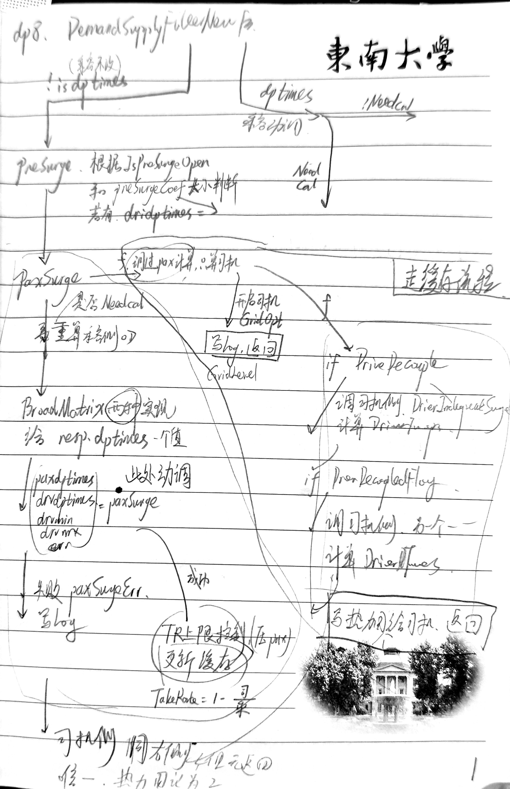
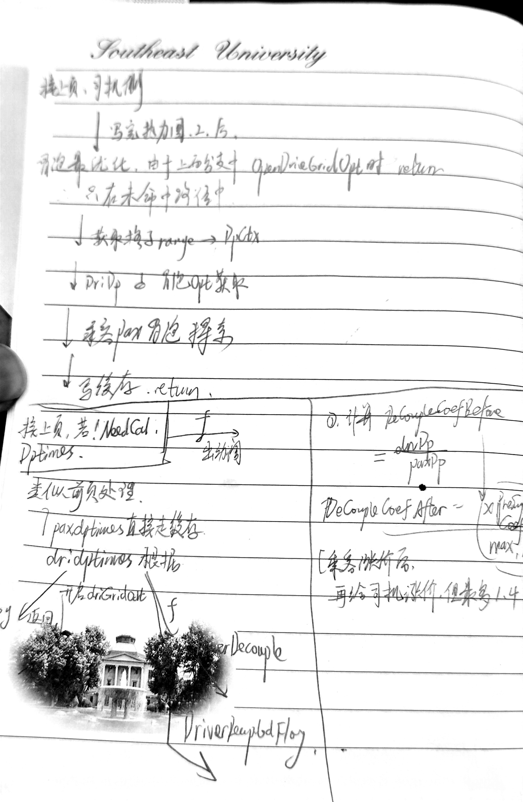
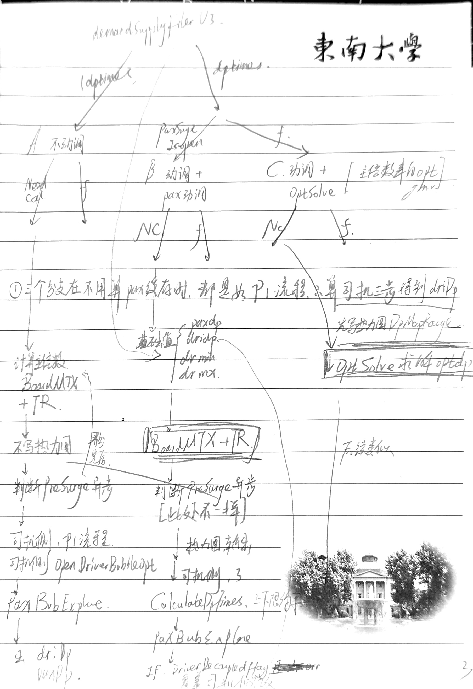
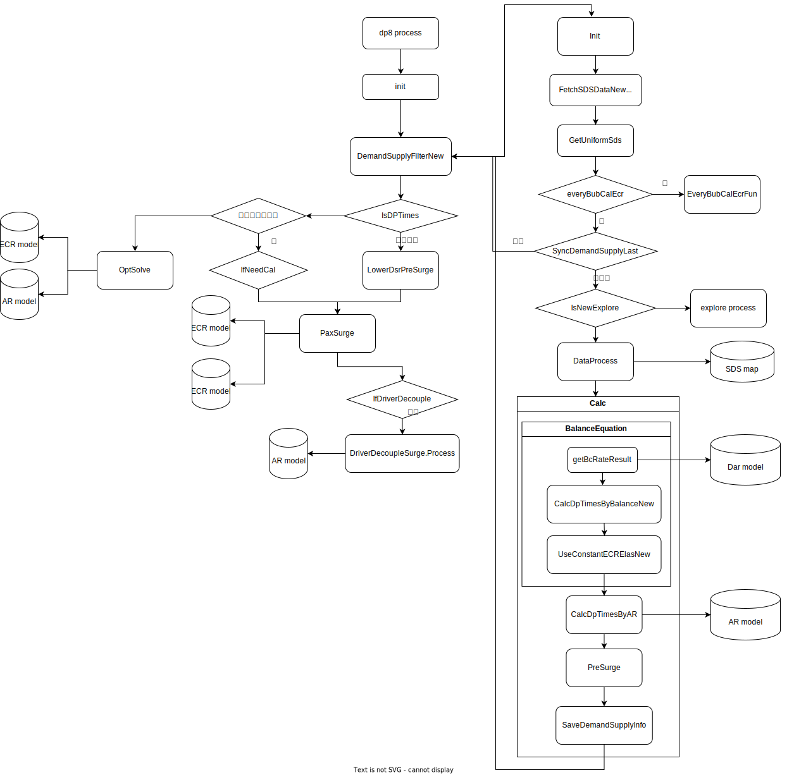

# 07第三周
## day1
根据之前会议记录，先看ar-trigger中的网络升级</br>
首先学习如下论文架构：</br>
### 保序多变量单调网络
Deep Isotonic Embedding Network: A flexible Monotonic Neural Network</br>

### 多任务学习经典mmoe
Modeling Task Relationships in Multi-task Learning with Multi-gate Mixture-of-Experts</br>

### 查看学习线上的dipn代码 
model- v2线性加价模型：接单概率 = sigmoid(斜率 × 加价倍数 + 截距)。

目的还是为了让ddt和ar之间保证单调递增关系，网络结构如下。先分为ddt，cate，dense三类，ddt做单调约束，其他两类正常走全连接层。（好像是dien的单变量极简版）
最后为了保证单调性设置输出为 $ar = sigmoid ({a_1}*{ddt} +{c_1})$</br>
数学角度来说，由于$∂ar/∂ddt = ar(1-ar) * a_1  $，前一项在0.25-0.5，因此只要保证后一项正数，这在最后使用leaky_relu可以保证。</br>
看它的代码里，输出的 o1,a1,c1 分别叫 outputs,mp_r_s,env_r_s 。应该是下面的解释方式：</br>
```
接单概率 = sigmoid( 加价效应 × 加价倍数  +  环境基线 )
              ↑          ↑        ↑              ↑
           output      mp_r_s    ddt          env_r_s
```
```
  原始 feature_mat (batch, num_features)
     │
     ├─ ddt = driver_dynamic_times 那一列 (batch,1) ── 原始值，不归一化 ──────┐
     │                                                                        │
     └─ 其余所有特征 ──► INPUT_LAYER ──► x1 (batch, final_size)               │
                                            │                                 │
                                      shared_net  (MLP: input→256→128→64→64)  │
                                            │ shared_feat (batch,64)          │
                                      net_s (64→32→2)                         │
                                            │ ab (batch,2)                    │
                                ┌───────────┴───────────┐                     │
                         a1 = leaky_relu(ab[:,0])    c1 = ab[:,1]             │
                          (batch,1) 斜率(≈≥0)         (batch,1) 截距            │
                                └───────────┬───────────┘                     │
                                            ▼                                 ▼
                                o1 = sigmoid( a1 * ddt + c1 )  ◄──────────────┘
                                            │
                                   accept 概率 (batch,1)
```

## day2 3
### 查看学习线上的dipn代码 
model-v3 学习uplift效应：接单概率 = sigmoid(Σ 逐档权重)，每个加价档位（0.1）独立学习一个边际贡献。
这个就和线上文档的对上了。

v3模型使用了一个isotonic embedding，可以一次性输出不同treatment所带来的delta uplift，它的emb具体如下：</br>
ddt = 1.0 → [1, 0, 0, 0, ..., 0]    # 第 1 档 = 1，其余 0</br>
ddt = 1.5 → [1, 1, 1, 1, 1, 1, 0, ..., 0]  # 前 6 档 = 1</br>
ddt = 3.1 → [1, 1, 1, 1, ..., 1]    # 全部 22 档 = 1</br>
每个 wₖ 代表"加价从 levelₖ₋₁ 到 levelₖ 这一档带来的边际 logit 贡献</br>。

如何保证单调性：predict输出y和22-dim uplift，其中基础价格用leaky_relu，delta用softplus，就保证分段单调增

### 重跑了v2和v3模型
在离线数据上跑了一下它的两个模型，auc和文档里有点差距，可能我看到的不是最终版？

### 线上策略代码dp8细看

dp8结构 </br>
```
  │ 1   │ 入口与 defer 收尾               │ 98–109  │ 计时、最终埋点、mock 兜底                         │
  ├─────┼─────────────────────────────────┼─────────┼───────────────────────────────────────────────────┤
  │ 2   │ 配置与上下文初始化              │ 110–151 │ 拉 surgeConfig、init、离线特征、解耦开关          │
  ├─────┼─────────────────────────────────┼─────────┼───────────────────────────────────────────────────┤
  │ 3   │ 供需过滤（是否出动调判定）      │ 153–172 │ DemandSupplyFilterV3/New → 定 IsDPTimes           │
  ├─────┼─────────────────────────────────┼─────────┼───────────────────────────────────────────────────┤
  │ 4   │ 埋点 + 计算前准备               │ 174–208 │ PublicLog 写入、initCustom、InitParams            │
  ├─────┼─────────────────────────────────┼─────────┼───────────────────────────────────────────────────┤
  │ 5   │ Explore 短路                    │ 210–221 │ 命中实验直接返回                                  │
  ├─────┼─────────────────────────────────┼─────────┼───────────────────────────────────────────────────┤
  │ 6   │ 分支 A：不出动调 (!IsDPTimes)   │ 223–413 │ 缓存命中 / 乘客动调 / 司机解耦 / 冒泡最优化       │
  ├─────┼─────────────────────────────────┼─────────┼───────────────────────────────────────────────────┤
  │ 7   │ 分支 B：出动调 + 乘客动调开启   │ 415–641 │ 基础值构建 → PaxSurge → 司机侧 → CalculateDpTimes │
  ├─────┼─────────────────────────────────┼─────────┼───────────────────────────────────────────────────┤
  │ 8   │ 分支 C：出动调 + 乘客动调未开启 │ 642–776 │ 热力图范围 → OptSolve GMV 最优化 → 司机侧         │
  ├─────┼─────────────────────────────────┼─────────┼───────────────────────────────────────────────────┤
  │ 9   │ 最终 metric 收尾                │ 778–781 │ opt 耗时上报                                      │
```
#### 1. 入口和defer结尾
- 定义了一个结构体DP8_0，所有的信息基本都挂在里面。Process传的是stg *DP8_0，对 stg.XXX 的写入都会持久保留，后续在init、DemandSupplyFilter、各分支间通过 stg 传递中间状态。</br>
- 返回值都是err，哪里报错了就在哪里返回，没问题最后return nil 最后有一个defer确保收尾，统计耗时，关闭热力图写入ctx.Custom.SynTimesSDS = false

#### 2. 配置和context init & 获取工程产出实时特征和离线特征
- 先从线上服务apollo拉取配置，覆盖stg结构体里的默认值，包括几个比较重要的stg.DecoupleCoef,stg.PaxSurgeConfig ...,赋值stg.dpctx，因为dp业务只看到dpctx。然后if versionConfig, ok := stg.DpCtx.SurgeConfig.StgParams[ctx.Custom.DPVersion]（按 ctx.DPVersion做版本路由确定策略版本）
- 离线特征拉取：异常和空都不报错，直接置空；实时特征拉取，仅当乘客动调开启（PaxSurgeConfig.IsOpen）取。
- 配置司乘开关，两个不一样！，stg.DpCtx.IfDriverDecouple（司机独立动调，再走一遍surge）  stg.DpCtx.DriverDecoupledFlag（是否司乘解耦，否的话drv由pax决定）

#### 3. DemandSupplyFilterV3判断供需（内部细节主要见202607w2，这里写在管线里的作用）
- 出结果，包括IsDPTimes——是否出动调（供需紧张→true 要涨价调节；供需平衡→false 倍数保持1；DemandSupplyRate（供需比）、FilterDPTimes（过滤后的基准动调倍数）、BcRate、FeedbackCoef、PreSurgeCoef（异步动调系数）、EyeballSupplyRate、DemandSupplyIsNeedCal（是否需要计算）等一系列供需侧中间值。都写入stg.dpctx

#### 4. 计算前准备 174-208
- 将3中算出来的中间值存到stg.publiclog,做埋点，GridDpMax/Min = FilterDPTimes ± 0.3给个dp范围给后续的格子最优化和司机侧
- 设置explore机制开关，if !stg.DpCtx.IsDPTimes {ctx.PublicLog.HitDptimesExplore = false  stg.DpCtx.HitDptimesExplore = false}只有需要dp时才进行流量探索。动调倍数探索实验：命中时会在最终倍数上叠加一个探索增量。
- stg.initCustom(ctx) 设置ctx中的DpInfoForCache热力图缓存和DpExploreInfo探索命中为默认值1，f。 然后出一个模块3供需过滤失败的延时返回，后续的都应该是供需过滤无问题的。
- stg.initPrams(ctx) 获取倍数缓存，为后续直接复用而跳过重算，包括：上次的 LastDpTimes / LastDriDpTimes；乘客动调前后、异步动调前后的各倍数；探索命中信息、ODValidUntil（缓存有效期）等。为后续各个分支里的IfNeedCal准备

#### 5. 流量探索explore短路返回 （ExploreProcess，在dp_explore.go）
- 在所有正常策略之前插入短路，IsExploreOpen且命中缓存中的探索标志（LastDpInfo.IsExplore）时，用实验倍数直接返回；出错或未命中则分别返回错误或继续走后续策略

#### 6. 各类分支处理
##### 6.1 !IsDPTimes，判断是否有异步动调（乘客不动，司机加价）
`
  ├─ 【分支A】IsDPTimes = false（不需要加价）
  │     ├─ PaxSurge 关闭 → 返回 dpTimes=1.0。# 不加价不动调
  │     └─ PaxSurge 开启 → 仍有乘客动调（低供需时也可能调高）
  │         ├─ 有 OD 缓存 → 走司机解耦 + 热力图写回，直接返回
  │         └─ 无缓存 → PaxSurge.PaxSurge() + TR上限 + 司机解耦 + BubbleOpt`

- 此时不出乘客dp，不写热力图，先判断低dsr下司机侧系数；再判断缓存过期后重算的司机侧系数，2覆盖1 .
- 1. IsOpenPreSurge时，走stg.LowerDsrPreSurge；前面供需过滤传来PreSurgeCoef：if PreSurgeCoef < min(1, DriverNoSurgeThreshold) 不加司机 ，else dridptimes=PreSurgeCoef；乘客/司机 加价前/后 dptimes写入log。
- 2. PaxSurgeConfig.IsOpen时：
- 若有乘客缓存，!NeedCal，走如下逻辑后直接结束dp8：若OpenDriverGridOpt使用格子最优化，按格子维度另行缓存/最优化的，缓存命中就直接用格子结果，跳过bubble级的一切司机侧计算，写log后返回。  若IfDriverDecouple，司机独立动调，调用driversurge.DriverIndependentSurge计算DriDpTimes，写入resp，乘客PaxDynamicTimes直接读resp里的,写热力图，状态1。  若DriverDecoupledFlag，调用driversurge.DriverDecoupledConfig计算DriverOptDpTimes，写入resp，乘客PaxDynamicTimes直接读resp里的，写热力图。
- 若无乘客缓存，走如下逻辑：（这里是增加了乘客动调处理的逻辑）先用UseBroadMatrix/BroadType两类播单矩阵方式获得dptimes写入resp.dptimes。然后调用paxsurge.PaxSurge出paxDpTimes，drvDpTimes，paxerr。如果出paxerr写log，否则走stg.trCapControl(ctx, paxDpTimes, drvDpTimes)，通过压paxdp，控制抽成takerate。完成这些后重写缓存。
- 接上上步继续处理司机侧，同上上步对司机的两类动调处理，写热力图状态2，进行司机冒泡最优化driversurge.BubbleDriverOptimization（只在没有命中格子最优化情况下），进行乘客冒泡探索（唯一会动乘客倍数）。PaxBubExplore（dp_explore.go:495）在冒泡（预估价）阶段按概率对乘客倍数做随机探索：
  - 不出动调时（dpTimes<=1，分支 A 常见）：按 PaxBubNosurgeExploreRate 概率命中，在 [1.0, min(driDp×1.3, 1+margin)]
    内随机取一个乘客倍数；
  - 命中则打 PaxBubExploreHit / Tag，还可能触发一口价（PTP）联动探索（popPtpMap 里 BR/MX/CO 等各国 ProductID）；
  - 未命中就原样返回输入值。
- 写缓存结束。

##### 6.2和后续
本策略分三个分支，分别对应如下。每个分支又分为需要重计算pax侧需求和不需要重计算。每个分支的逻辑都是（如有）先计算主倍数，再算是否有presurge，再司机侧判断是否格子最优化、是否drivedecouple、是否driverdecoupedflag，再司机侧冒泡最优化，在乘客pax冒泡探索，最终返回dri pax dp。
`
flowchart TD
      Start(["Process 入口"]) --> Init["模块1-2 init 配置装配<br/>拉 surgeConfig / 离线·实时特征<br/>定两个司机解耦开关"]
      Init --> DS["模块3 供需过滤<br/>DemandSupplyFilter → 定 IsDPTimes"]
      DS --> Prep["模块4 埋点 + initCustom<br/>InitParams 拉倍数缓存"]
      Prep --> Exp{"模块5 Explore<br/>开启且命中?"}
      Exp -->|命中| Ret(("return"))
      Exp -->|未命中| Top{"IsDPTimes?"}

      subgraph A["分支 A：不出动调"]
          A0["SynTimesSDS=false 不写乘客热力图"] --> A1{"IsOpenPreSurge?"}
          A1 -->|是| A1a["LowerDsrPreSurge<br/>乘客=1 / 司机=PreSurgeCoef"]
          A1 -->|否| A2{"乘客动调开<br/>且缓存命中?"}
          A1a --> A2
          A2 -->|命中| A3["司机侧补算<br/>GridOpt→return / 独立 / 解耦"] --> ARet(("return"))
          A2 -->|未命中或未开| A4["乘客动调<br/>播单矩阵（NoSurge上限）+PaxSurge+TR"]
          A4 --> A5["司机侧三连击<br/>独立 → 解耦 → 冒泡最优化"]
          A5 --> A6["PaxBubExplore 乘客探索"]
          A6 --> A7{"有动调机制<br/>且倍数>1?"}
          A7 -->|是| A8["SyncDpTimes 落缓存"] --> ARet2(("return"))
          A7 -->|否| ARet2
      end
  
      subgraph B["分支 B：出动调 + 乘客动调开"]
          B1{"缓存命中?"} -->|命中| B1a["司机侧补算 → return"] --> BRet(("return"))
          B1 -->|未命中| B2["基础值构建<br/>paxDp=max（Filter,OptMin）<br/>drvDp=pax×解耦系数 · ±0.2区间"]
          B2 --> B3["乘客动调<br/>播单矩阵（Surge上下限）+PaxSurge+TR"]
          B3 --> B4["异步动调<br/>放大解耦系数（顶1.4）"]
          B4 --> B5{"!IfDriverDecouple?"}
          B5 -->|是| B5a["热力图输出 SetDpHeatMapCache"] --> B6
          B5 -->|否| B6["司机侧三连击<br/>独立 → 解耦 → 冒泡最优化"]
          B6 --> B7["CalculateDpTimes 上下限裁剪"]
          B7 --> B8["PaxBubExplore 乘客探索"]
          B8 --> B9{"司机解耦配置<br/>成功?"}
          B9 -->|是| B9a["覆盖司机倍数<br/>=DriverOptDpTimes"] --> B10["SyncDpTimes 落缓存（无条件）"]
          B9 -->|否| B10
      end

      subgraph C["分支 C：出动调 + 乘客动调关"]
          C1["DpHeatMapRange 先算热力图范围"] --> C2{"缓存命中?"}
          C2 -->|命中| C2a["司机侧补算 → return"] --> CRet(("return"))
          C2 -->|未命中| C3["热力图缓存 SetDpHeatMapCache"]
          C3 --> C4["OptSolve GMV最优化+拉格朗日<br/>失败 → FilterDPTimes 兜底"]
          C4 --> C5["异步动调<br/>直接放大 DecoupleCoef（顶1.4）"]
          C5 --> C6["CalculateDpTimes 上下限裁剪"]
          C6 --> C7["司机侧三连击<br/>独立 → 解耦 → 冒泡最优化"]
          C7 --> C8["PaxBubExplore 乘客探索"]
          C8 --> C9["SyncDpTimes 落缓存（无条件）"]
      end

      Top -->|false| A0
      Top -->|true| PB{"PaxSurgeConfig<br/>.IsOpen?"}
      PB -->|true| B1
      PB -->|false| C1

      Ret --> End
      ARet --> End
      ARet2 --> End
      BRet --> End
      B10 --> End
      CRet --> End
      C9 --> End
      End["模块9 metric 收尾<br/>defer: 计时 / 上报状态码 / CalcSurgeMetrics"] --> Done(["结束"])

      classDef core fill:#ffe6cc,stroke:#d79b00,stroke-width:2px;
      class A4,B3,C4 core;`

dp8的逻辑分支如下三张图所示，其中前两张里详细写了三分支里类似逻辑的实现，后一张是总体的分支走向：
 </br>
 </br>
 </br>

文档里有一个比较全的如下：

## day 4
### 细看动调分支C中提到的最优化模块OptSolve
optsolve是在供需过滤模块出isdptimes和!paxsurge.Isopen时，且未命中乘客dp缓存，走的逻辑，根据模型预估值和lambda系数计算优化动调倍数，函数头为 </br>
`func (stg *DP8_0) OptSolve(ctx *common.Context) (dpTimes float64, err error) 
`
关键步骤：
1. GetLagrangeResult 根据cityId ProductID 获取 lambdaCR 
获取拉格朗日乘子，新建三个空数组 candidateDp[]（候选倍数）、ecrProbs[]、crProbs[]
2. GetOptDPRange 根据热力图上下限、解耦系数、eda等，计算dp倍数搜索区间
3. 获取候选倍数的 ecr cr模型预估分probs，这里有三种方法：deepmodel，new-ecr和const-elas
4. 计算 resultGmv = ecrProbs*crProbs*PreTotalFee*candidateDp + lambdaCR*(crProbs-OptCrTarget) 找到使之最大的动调倍数。 带约束原问题如下；在保证cr不低于targetcr时，GMV最大化：
  $$\max_{dp}\ \underbrace{ecr(dp)\cdot cr(dp)\cdot PreTotalFee\cdot dp}_{\text{期望 GMV}}\qquad \text{s.t.}\quad cr(dp)\ \ge\
  OptCrTarget$$
