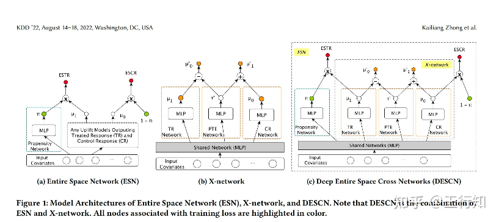

# 第9周实习记录

## 6月9日
1. 检查s-learner的多treatment模型，发现画出的auuc曲线有问题，尝试解决。
目前要做的是探究dp times和ar之间的关系,但是在训练模型时，又人为加上了dp times和ar间的约束，那么练出来的模型能否反映真实的dp times和ar的关系呢？ 

## 6月10日
1. 解决画图问题  
在画auuc曲线时，在原先的计算方式上考虑到正负样本不平衡，所以添加了系数，之后auuc曲线正常，但是slearner在高动调倍数时，random提升的斜率<0，
可能是s-learner方法自身的问题:s-learner方法由于将t和x一起作为输入，当x维度很高时，模型很可能会忽视干预标签t带来的影响，训练效果也会受到影响。 
2. r-learner的多treatment模型实现和评估  

## 6月11日
学校中期，请假。

## 6月12日
1. 继续r-learner的多treatment模型实现和评估  
目前r-learner训练速度比较慢，可能是随机森林导致第一步的nuisance model拟合速度慢，尝试使用xgboost替换随机森林,或者降低树的数量。(解决，降低树的数量) 
评估r-learner，并且和其他三个meta- learner方法对比。r-learner方法在高倍数动调时，提升效果明显。在低倍数下斜率<0,需要查看原因。 
2. 直接对uplift建模，uplift树模型（包括单个的uplift tree和多个的causal forest的实现和评估  
树模型有现成的库可以用，比较方便。

## 6月13日
1. 学习策略中台的使用，准备接下来的线上实验。 
2. 在本机训练dml方法，没并行计算库所以只用了一部分数据，模型效果不佳，同时学习了causalml库和econml库，前者没有针对多treatment的画图和计算auuc，目前我的计算方法还是基于uber那篇文章。 
3. 在本机训练深度学习模型，目前已有tarnet和descn的代码，可以抄一下。 
### descn网络原理图&论文
https://arxiv.org/pdf/2207.09920

## 本周总结
1. 完成了三种metalearning方法的实现和评估,目前看来x-learner的效果最好，至少它的两根random线都是正的斜率。
2. 在本机上训练了dml方法，但是由于mac上没有libomp库，dml训练比较慢
3. 开始实现多treatment的descn方法