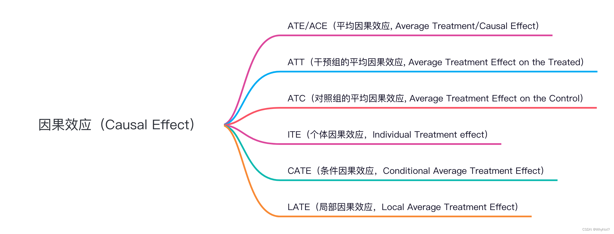

# 动调实习第 6 周记录
## 本周计划
- 继续学习[uplift](https://zhuanlan.zhihu.com/p/425898510)
- 优化已有的dl模型

## 5月19日 & 20日
### 继续学习uplift
1. uplift的定义 && 矛盾的目标  
Uplift models用于预测一个treatment的增量反馈价值，也就是lift的部分。 
由于不能同时观测到对同一个用户对这两个值和（一个用户无法同时被干预+不干预），可以通过子人群的增益效果来推断个体的增益效果。 
2. uplift的几个重要概念  
Uplift是Causal Inference的一个应用，通过计算cate（conditional average treatment effect）来估计ite（individual treatment effect）。记$Y_1$,$Y_0$为用户收到影响/不收到影响下的outcome。  

* 因果效应uplift/个体的ite：$U = E[Y_1 - Y_0]$，即treatment和no treatment下的outcome的差值。可以表示treatment的增量价值。 
* 用户实际被观测到的outcome：$ Y = Y_1 * T + Y_0 * (1 - T)$, 其中$Y_1$是treatment下的outcome，$Y_0$是no treatment下的outcome，$T$是treatment的0-1指示变量。 
* 条件独立假设（CIA）：$Y_1 \perp Y_0 | X$，即在给定X的条件下，treatment和outcome是独立的（用户被分到实验组还是对照组和用户本身无关） 
* 在CIA成立情况下，可以估算总体中子人群被干预的因果效应期望cate：$U = E[Y_1] - E[Y_0] = E[Y_1|X] - E[Y_0|X] = E[Y|X,T=1] - E[Y|X,T=0]$,即uplift等于实验组平均值和对照组平均值的差。 
* 倾向分Propensity Score：$P(X) = P(T=1|X)$，即在给定X的条件下，用户被分到实验组（被干预）的概率。 

3. Uplift Modeling  
建模思路大致分为三种： 
(1). 双模型：建立两个对于outcome的预测模型，一个在实验组数据一个在对照组数据。（T-learner）（以及它的变体X-learner） 
通常作为baseline方法，对$E[Y_1|X]$,$E[Y_0|X]$分别建模，对于每一个用户做差计算出uplift。优点简单易用；缺点没有直接对uplift建模。  
(2). class transoformation method：适用于Y是二分类的情况。（S-learner） 
对于单个用户i，构造目标函数$ Z_i = {Y_i}^{obs} * T_i +(1 - {Y_i}^{obs}) * (1 - T_i)$，即在实验组下的outcome和对照组下的outcome的期望差。 
满足条件 $p(x_i) = P(T=1|X_i) = 1/2 $ 时，uplift可以被表示为：$ U = E[Y_1|X] - E[Y_0|X] = P(Z = 1|X)- P[Z=0|X =  P(Z = 1|X) - (1 - PC[Z=0|X]) = 2* P(Z = 1|X) - 1$  
缺点：需要满足两个假设——1. 二分类场景，2. 数据在实验/对照组的分布一致，较为严格。可以拓宽到样本不均衡分布（倾向分不为1/2）的情况。  
此时cate可以被写为： $Y_i =  \frac{Y_i(1) * T_i }{P(T=1|X_i)} + \frac{Y_i(0) * (1 - T_i)}{1 - P(T=1|X_i)}$，即在实验组下的outcome和对照组下的outcome的期望差。 
(3). 直接建模：直接对uplift进行建模。 
uplift树模型Tree-Based Method，可以处理二分类treatment，改进方法使用cts(contextual treatment selection)可以处理多分类的treatment。 
深度学习模型，直接对uplift建模。 

4. 四种meta-learner方法详细介绍  
(1). T-learner  
简介：差分响应模型，Two-model learner：先对于T=0的control组和T=1的treatment组分别学习一个有监督的模型。control组模型只用control组的数据，treatment组模型只用treatment组的数据。 
原理：control组学习出的模型输出为 $u_0(x) = E[Y_0|X=x]$，treatment组的为 $u_1(x) = E[Y_1|X=x]$。 
最终预测的uplift为 $U(x) = u_1(x) - u_0(x)$。 
优点是原理简单，分组后分别拟合即可，缺点是误差累积，对response建模后做差得到的uplift，只能用于离散treatment。 
(2). S-learner  
简介：Single-model， 将treatment也作为一个特征输入到模型中，直接对uplift进行建模。 
原理：训练一个机器学习模型，输出 $u(x) = E[Y|X=x, T=t]$ ,模型直接建模的还是response值，然后间接求出uplift $U(x) = u(x,T=1) -u(x,T=0) $。 
优点是没分组，数据利用充分，缺点是还是间接建模uplift，且特征列X和treatment维度差距过大容易学崩。 
(3). X-learner  
简介：类似T-learner的小变体。 
原理：先对treatment组和control组分别建模，得到 $u_1(x) = E[Y_1|X=x]$ 和 $u_0(x) = E[Y_0|X=x]$。（这步和T-learner一样） 
得到两个模型后，分别计算control组和treatment组的diff：${D_i}^{1} = {Y_i}^1 - u_0({x_i}^1)$ 和 $D_i^{0} =u_1({x_i}^0)-{Y_i}^0$。注意这里出现的交叉，diff表示组内预测值和实际值的差。 
再用两个机器学习模型来拟合这两个diff，得到 $d_1(x) = E[D^{1}|X=x]$ 和 $d_0(x) = E[D^{0}|X=x]$。 
最后的uplift预测为 $U(x) = p(x) d_0(x) +(1-p(x)) d_1(x)$。p(x)是倾向分，注意这里又交叉一次。  
(4). R-learner  
原理：和dml类似，可以看作是原始的dml（如果看了causalml库的源码会发现，这个库里的dml是继承的R-learner） 
5. [uplift evaluation](https://blog.csdn.net/JESSIENOTCAR/article/details/132625380)  
uplift评估最大的难点在于我们并没有单个用户uplift的ground truth，因此传统的评估指标像AUC是无法直接使用的。 
* auuc（area under uplift curve）是uplift模型的评价指标。 
* 第k个Uplift值的含义是：根据uplift score值从大到小对数据集D排序，即score值高的排在前面，前k个人中实验组平均产生的价值-前k个人中空白组平均产生的价值。依次类推，我们可以得到第1~n个Uplift值，可以根据此画出曲线。

* ite 个体提升效果，对同一个对象，处理和不处理，outcome的差值，**不可观测的，一个人不能既要又要**。$ \tau_i = Y_i(T=1) - Y_i(T=0)$
* ate 平均提升效果，收到/不收到处理的outcome的差值，是一种估计；可能存在其他混淆变量导致两个组outcome有差异，因此存在偏差 $ate = E[Y|X=1] - E[Y|X=0]$
* att/atc 平均处理效果/平均控制效果，关注一部分对象，$ \tau_{att} = E[|Y_i(T=1) - Y_i(T=0)|T=1]$, atc同理  
* cate 条件平均处理效应，$\tau_{cate} = E[Y(1) - Y(0) | X=x]$
* 三组关系： $ate = E[ite] $
### Deep & Cross Network 捕捉高阶特征（已完成）
在原先的monotonic网络中加入两层deep cross net来捕捉高阶特征，同时可以确保dp times的单调性。  
dcn的性能如下：

### 关于为什么还不涨点的疑问 & 对策
改激活函数试试，目前monotonic的结构用的tanh  
特征工程做的还不够,树模型可以达到0.73,按道理深度模型也可以  
对于低ar的样本预测不准确，其实还是没解决训练平衡的问题  

## 5月21日
1. 对网络的激活函数进行改进，在monotonicNet中使用leakyrelu和silu分别修改对比了一下，发现silu比之前用tanh的效果好，推测可能是tanh会梯度消失。  
2. 下午1400-1500参加关于因果推断的经验分享，学习目前因果推断的新技术和长期因果推断等研究方向，知道了因果推断等应用场景。 
3. 观察发现每次预测出的值和实际值的均值间总是偏低0.001，推测是否是因为测试集和训练集的分布原因。(已解决，是l1正则项设置过大，导致过于稀疏)  
4. 观察到真实数据中，存在dptimes很高（3.0）但是ar很低的个体。需要查看个体的特征。 

## 5月22日
参考了一篇[点击率预测模型方法](https://mp.weixin.qq.com/s?__biz=MzU1NTMyOTI4Mw==&mid=2247570937&idx=1&sn=aa619fe9ca5ce9b655368d11bed4f42a&scene=21#wechat_redirect)  
其中提到了上述的方法都是对于组合特征进行建模，提到了autodis方法，尝试使用 filedembedding 和 autodis 方法对连续特征进行处理。 

### Autodis思路
[原文](https://arxiv.org/pdf/2012.08986)  
autodis方法分为三个部分：metaembeddings, automatic discretization and aggregation
对于第j个连续特征 $x_j$，autodis的总架构为获得其embedding向量 $e_j = f(d(x_j), {ME}_j)$，其中$ME_j$是metaembeddings，$d(x_j)$是automatic dis的结果。 
1. ME矩阵 
$ {ME}_j \in R^{H_j * d} $, 这里的 $H_j$是特征j的embedding的个数，d是embedding的维度。可以看作nn.embedding里的输入维度输出维度。  
2. automatic discretization 
自动离散化机制 $d(x_j)$，对于$x_j$，将其软分到 $H_j$个桶中，输出每一个桶的概率分布。具体方法是两层神经网络+softmax。$h_𝑗 = Leaky_ReLU(w_𝑗 𝑥_𝑗), {x}^-_𝑗 = W_𝑗h_𝑗 + 𝛼h_j, {x}^final_j = softmax({x}^-_𝑗)$  
原文：The discretized result x𝑗 is a vector where each element denotes the probability that feature 𝑥𝑗 is discretized to the ℎ-th bucket.作用是解决了hard discretization各种经典问题。 
3. aggregation  
f() 选取e_j的规则 maxpooling + top-k-sum  
选取概率最大的前k个桶的embedding向量进行加权求和。权重为属于每个桶的概率。最终得到$e_j$。 

### Autodis+MonotonicNet
因为用了类似attention的机制，所以目前的机子可能跑不动。 

## 5月23日
学校有事请假一天回南京，本日无内容。

## 本周总结
1. 本周基本完成了对因果推断和uplift的学习，了解了uplift的基本概念和建模思路。参加了因果推断的经验分享，了解因果推断在各个厂的应用场景。 
2. 实现了带dp times的单调约束的deep&cross network，发现这个模型的时间开销太大，没有gpu情况下一小时练完，下周可能要申请gpu。 
3. 反思模型激活函数选择，试出了模型激活函数的最佳情况silu，又快又好。 
4. 直觉上特征工程肯定没做好，目前优化想法就是对于数值变量，之前都是分桶进行hard discretization，参考了autodis方法进行soft embedding，代码写完了，暂时没有运行看效果。 
