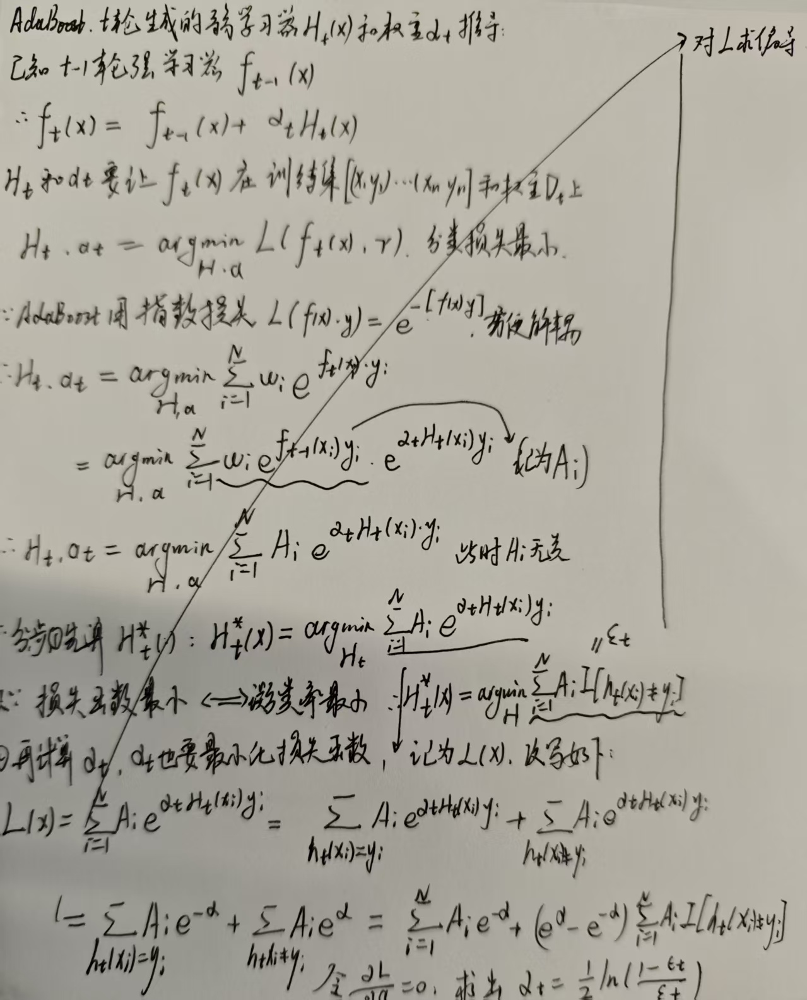
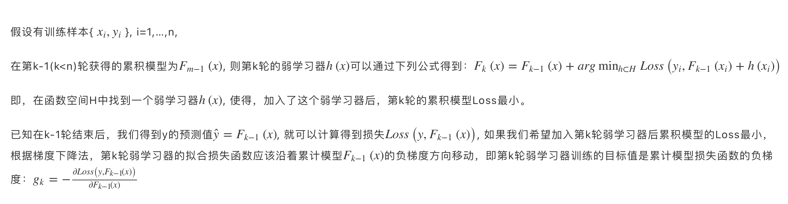
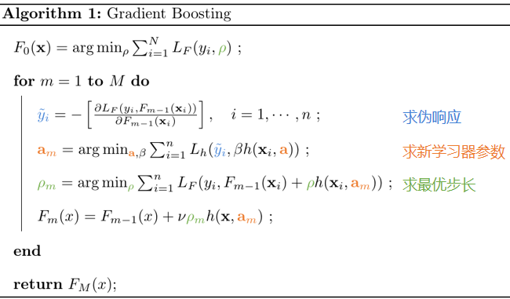

# 传统监督学习方法续-集成学习
## 6. 提升方法 （李航书只写了adaboost，这里参考西瓜书，全补上了。）
提升方法基于一个定理：若一个概念是弱可学习的，那么它必然是强可学习的。  
提升方法的三类基本方式 ：stacking，bagging，boosting。 它们的结构图可以参考[这篇](https://zhuanlan.zhihu.com/p/86263786)，非常形象。  
在提升算法中，基学习器可以是同质的，也可以是异质的。 
* 集成学习从一群弱学习器中，学习强学习器，如何保证强学习器的性能呢？西瓜书P173提到，如果弱学习器的错误率相互独立，且错误率小于1/2，那么通过集成学习，可以将错误率降低到0。这个定理是由Hoeffding不等式推导出来的。  
* 但是,由于个体弱学习器都是为了解决同一个问题，所以他们的错误率并不是相互独立的，所以这个定理并不适用于实际情况。需要取舍，达到“好而不同”的效果。   
简单来说三类集成学习：  
1. Boosting:个体学习器间有强依赖关系，串行（阶梯状）生成，每个个体学习器都是在上一个学习器的基础上进行学习，尝试修正上一个学习器的错误。最后用加权等方式得到预测结果。  
2. Bagging:个体学习器间没有强依赖关系，可以并行生成，每个基学习器从全训练集中有放回抽样训练，个体学习器都是独立生成的，通过投票等方式进行集成。（Stacking算是他的变种）  
3. Stacking:先用全样本训练集练好基模，，每一个基础模型都对每一个样本训练，然后把这些预测结果作为新的特征，和原始特征一起组成新的训练集，再用一个学习器进行学习。  
- 一般来说，Bagging和Stacking中的基学习器为强模型（偏差小，方差大），Boosting中的基学习器为弱模型（偏差大，方差小，不准但是防过拟合）。  
- 在Bagging和Boosting中，模型都是线性组合的，因此可以计算模型总体期望和方差，证明集成学习可以降低方差、降低偏差。
### 6.1 Boosting（重点看，滴滴的算法，滴滴面试必问）
Boosting的思路：从初始训练集T中得到第一个基学习器，然后根据基学习器的表现对训练样本分布进行调整，使得先前基学习器做错的训练样本在后续受到更多关注，然后基于调整后的样本分布得到第二个基学习器，如此重复，直到基学习器数目达到事先指定的值T。再进行加权结合。 
#### 6.1.1 AdaBoost，1997年的经典算法
思路：前一个基本分类器被错误分类的样本的**权值会增大**，而正确分类的样本的**权值会减小**，并再次用来训练下一个基本分类器。同时，在每一轮迭代中，加入一个新的弱分类器，直到达到某个预定的足够小的错误率或达到预先指定的最大迭代次数才确定最终的强分类器。 
adaboosting算法伪代码如下，Adaboost 模型是加法模型，学习算法为前向分步学习算法，损失函数为指数函数的分类问题。（以二分类为例,回归的可以参考[这篇](https://zhuanlan.zhihu.com/p/125515419)）:  

1. 输入$S = {(X_1,y_1),...(X_n,y_n)};$ 初始化样本权重$D_0 = {w_1, w_2,... w_n},其中 w_i = \frac{1}{N}$ ；弱分类器h(x) 。 
2. 假设最后输出的强学习器为$H_T(x)$，初始化$H_1(x) = 0$,那么需要进行T轮迭代，每轮在上一轮的基础上训练一个弱学习器，同时改变样本权重：  
3. for t = 1 to T do  
    1. 计算当前样本权重D_t下的弱分类器$h_t(x)$的加权错误率 $\epsilon_t = P_{x~D_t}(h_t(x) \neq y) = \sum_{i=1}^{N} w_i I(h_t(x_i) \neq y_i)$ (这里容易发现算得就是误分类样本的权重的和)  
    2. 通过$\epsilon_t$计算该弱分类器的权重 $\alpha_t = \frac{1}{2}ln(\frac{1-\epsilon_t}{\epsilon_t})$ 这个对数项确保当$\epsilon_t<0.5$时，模型比瞎猜好，$\alpha_t > 0$，分类器误差率越小，$\alpha_t$越大，这一轮的弱学习器就越重要。  
    3. 更新样本权重，在这之前先算一个归一化因子$Z_t = \sum_{i=1}^{N} w_i exp(-\alpha_t y_i h_t(x_i))$，然后更新样本权重： 
    4. 更新权重 $w_i \leftarrow w_i exp(-\alpha_t y_i h_t(x_i))/Z_t$，其中$y_i h_t(x_i)$为1表示分类正确，为-1表示分类错误，所以分类错误的样本权重会增加，分类正确的样本权重会减小（Adaptive），归一化因子确保权重仍然是和为1的概率分布。  
    5. 组合得到当前的强分类器 $H_t(x) = H_{t-1}(x) + \alpha_t h_t(x)$  
4. end for  
5. 输出最终的强分类器 $H_T(x) = sign(\sum_{t=1}^{T} \alpha_t h_t(x))$  
6. 返回 $H_T(x)$  

* 上述步骤3.2中，t轮的弱分类器的权重$\alpha_t$的来源是t轮学到的弱分类器对权重梯度为0处的极值点，主要原因是adaboost方法的损失函数是指数损失函数，为什么使用指数损失，以及得到权重的推导过程见下图。 
  
* AdaBoost和GBDT的区别？
 原理上：AdaBoost 是通过提升错分数据点的权重改善模型，Gradient Boosting 通过算梯度改善。因此相比 AdaBoost,GB可以使用更多种类的目标函数。
 工程上：由于adaboost的每一步的前向加法有点类似牛顿迭代，而gbdt目前主流库的实现方法是牛顿法，因此可以说，当损失函数为指数损失函数时，gbdt和adaboost是的区别就在于基学习器的不同，adaboost用的是分类决策树(桩)，而gbdt用的是回归树。所以可以认为adaboost是GBDT的特例。  
* adaboost的误差率以指数速率下降。证明过程可以参考[清华书P74](https://www.tup.com.cn/upload/books/yz/084939-01.pdf)。  
#### 6.1.2 梯度提升机 GBM & 梯度提升树 GBDT 
梯度提升机（Gradient Boosting Machine）每个弱学习器的目标是拟合先前累加模型的损失函数的负梯度/（伪残差，pseudo-residual，当损失函数用平方差时，就是残差 $y_i- F_{t-1}(x_i)$，代表目前累加学习器和真实标签间的差值），使加上该弱学习器后的累积模型损失往负梯度的方向减少，最常用的基模型为树模型。 
观察梯度提升机的定义会发现，adaboost其实是一种使用了指数损失的GBM。 GBM的详细讲解可见[这里](https://zhuanlan.zhihu.com/p/361036526) 下图为gbm定义  
  
下图为gbm的更新流程，（1）先计算伪残差 （2）训练弱学习器$h_t()$，目的是拟合伪残差/最小化$h_t(x)$和先前训练器的伪残差(梯度)${y'}_i$ （3）已有的弱学习器此时需要加到累计学习器上，计算步长shrinkage，选择让损失函数最小的步长（最速下降法）（4）其中v为学习率，用来限制步长，因为弱学习器不够可靠，所以每次迈小一点。 
  

#### 6.1.3 超级梯度提升 XGBoost
Extreme Gradient Boosting，是Gradient Boosting的一种高效实现，主要是在损失函数上做了改进，加入了正则项，使得模型更加健壮。  

#### 6.1.4 轻量梯度提升机LightGBM
关于GBDT和XGBoost,可以[参考这里。](https://zhuanlan.zhihu.com/p/162001079)  
梯度提升决策树，是一种迭代的决策树算法，每次迭代都在训练集上拟合一个回归树，然后根据残差更新模型。  

### 6.2 Bagging
Bagging方法的代表就是RF。  