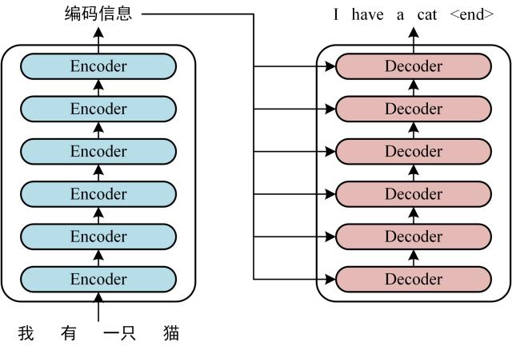
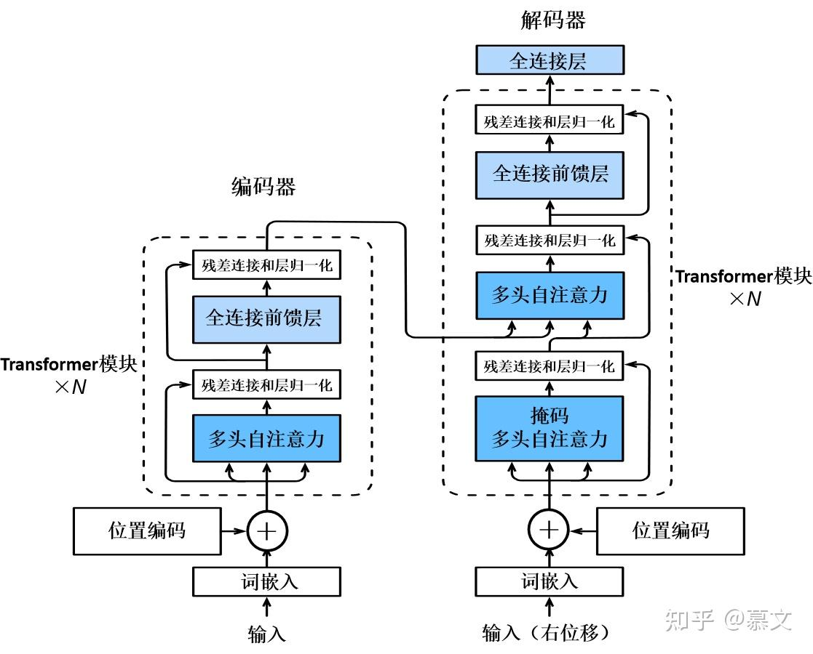
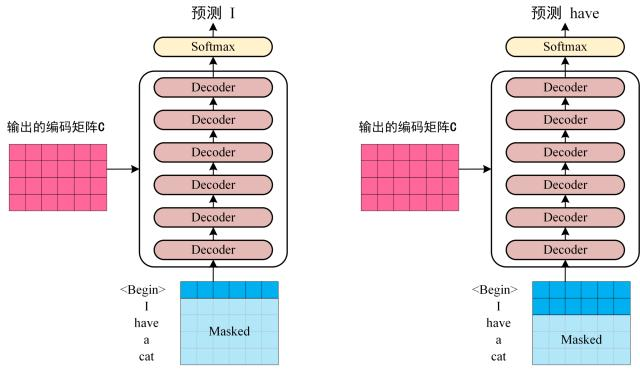
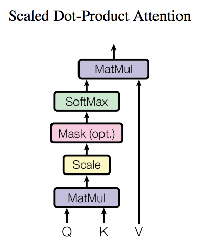
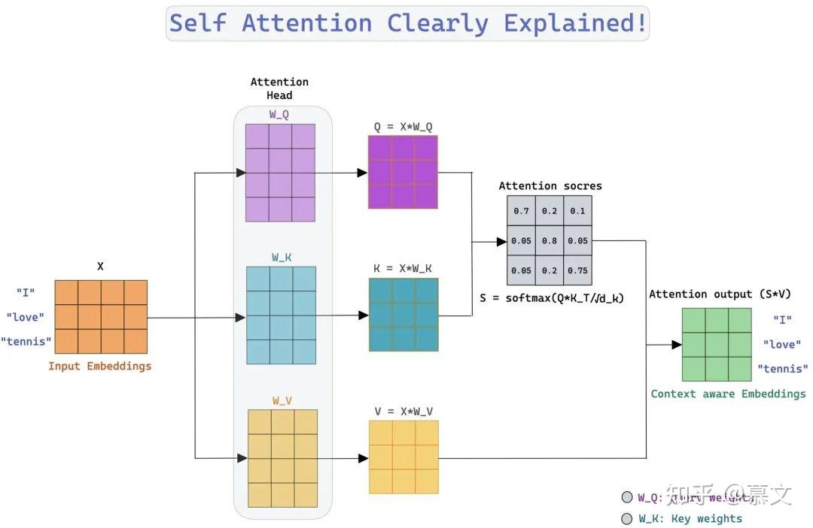
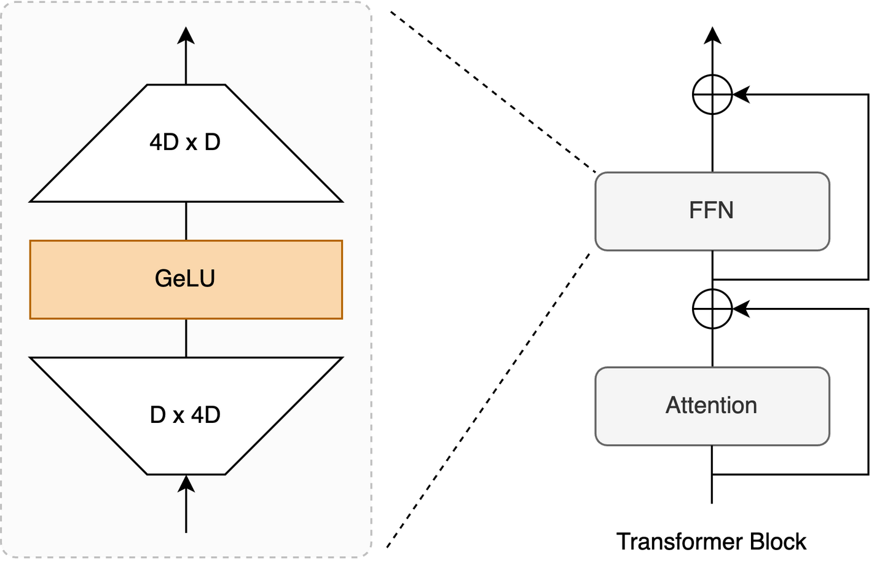

# transformer和attention机制
transformer来源于经典论文[Attention is all you need](https://arxiv.org/abs/1706.03762)，
该论文提出了一种全新的网络架构，完全基于注意力机制，摒弃了传统的循环神经网络（RNN）和卷积神经网络（CNN）。
Transformer在自然语言处理（NLP）任务中表现出色，并迅速成为该领域的主流方法。 
transformer由两部分组成，用来实现编码器-解码器结构，输入和输出都为sequence,整个的transformer如下所示,由于和变压器一样若干transformer层(6个)堆叠起来，因此得名。 

## 1. 总体encoder-decoder架构，如上图我有一只猫
在encoder中，每一个编码器的输出都作为下一个编码器的输入。 
在decoder中，每一个解码器的输出都作为下一个解码器的输入，同时每一个解码器还接受整个encoder块的输出作为输入。 

## 2. 输入输出pipeline(先不看里面如何操作)
1. 通过词嵌入+位置嵌入，得到每个单词的表示向量X,堆叠成为单词表示向量矩阵$X\in R^{n\times d}$，其中n为句子长度，d为词向量维度。 
2. 经过多个encoder后，得到输出矩阵$C\in R^{n\times d}$，每一行对应一个单词的表示向量。这个矩阵和输入的词向量矩阵是尺寸一致的。  
3. 将编码输出矩阵 C 传递给解码器。decoder会根据已经完成输出的1到t-1个单词来预测t个单词，并且会有一个mask来遮盖住未来的单词。 
transformer的输入输出可以参考下图： Decoder 先接收了 Encoder 的编码矩阵 C，然后首先输入一个翻译开始符 "<Begin>"，
预测第一个单词 "I"；然后输入翻译开始符 "<Begin>" 和单词 "I"，来预测单词 "have"，以此类推，不断的预测下一个。  

## 3.输入embedding
词嵌入方法：多种方法，可以word2vec, GloVe，也可以集成到transformer中一起训练。 
位置嵌入方法：由于transformer没有RNN的时间维度，不能利用顺序学习，因此需要用位置嵌入来保存单词在序列中的相对/绝对位置。 
位置嵌入向量 $PE$ 的维度和词嵌入向量是一致的，可以训练得到，也可以用公式得到，一种常见的（也是transformer使用的）位置嵌入方法是正余弦函数： 
$PE_{(pos, 2i)} = sin(pos/10000^{2i/d})$  
$PE_{(pos, 2i+1)} = cos(pos/10000^{2i/d})$  
其中 pos 是单词在序列中的位置，d是词向量维度，2i和2i+1分别表示位置嵌入向量的偶数和奇数维度。 
用正余弦嵌入的好处有两个：1. 可以表示任意长度的序列，防止出现测试集里没见过的长句 2. 可以通过线性变换表示相对位置关系。PE(pos+k)可以用PE(pos)算出。  

## 4. Attention机制,可以[参考这篇](https://zhuanlan.zhihu.com/p/47282410)
观察上面第二图，encoder和decoder的每一层都包含一个多头自注意力机制（Multi-Head Self-Attention Mechanism），以及一些全连接，残差和归一化层。
残差连接 (Residual Connection) 用于防止网络退化，Norm 表示 Layer Normalization，用于对每一层的激活值进行归一化，这些都是常规的改动。  
很明显最重要的是**Attention机制**。每一个multi-head attention模块包含多个attention头，每个头都可以看作是一个独立的注意力机制。 
### 4.1. Scaled Dot-Product Attention(self attention)，手撕可以[参考这篇](https://blog.csdn.net/m0_62030579/article/details/145164741)

Attention机制的核心思想是通过计算输入序列中各个位置之间的相关性，来动态地调整每个位置的表示。 
假设输入矩阵为 $X\in R^{n\times d}$，其中n为序列长度，d为词向量维度，先看单个单词的词向量$X_i$,通过三个不同的矩阵乘法$W_Q, W_K, W_V$，尺寸为$n * len_{qkv}$，得到查询向量（Query）$Q_i$，键向量（Key）$K_i$，值向量（Value）$V_i$。
这三个权重矩阵一开始是随机初始化的，训练过程中会梯度更新 
Q代表X想要得到的信息，K代表X所包含的信息，V代表X的实际信息。注意力公式 $Attention(Q,K,V) = softmax(\frac{QK^T}{\sqrt{d_k}})V$  
其中 $d_k$ 是键向量的维度，通常等于词向量,首先计算查询向量和所有键向量的点积，得到每个单词间的相关性分数 $QK^T$（除d_k防止内积过大，训练时帮助梯度稳定），然后通过softmax按行归一化，得到每个单词每个位置的权重，行和为1，最后用这些权重对值向量进行加权求和，得到最终的输出表示。 
因此，最终得到的是句中所有token间的权重分布。这里的输入X和Q K V 的每一行代表一个单词的向量表示。 
最终输出矩阵$Z\in R^{len_{qkv} \times d}$，每一行对应一个单词的新的表示向量。 

* 注：26.09.12的华为笔试考了一个LORA attention实现，说明可能有些厂会让手写attnion  
### 4.2. Multi-Head Attention 

### 4.3 残差连接和层归一化 

### 4.4 Feed Forward Network(FFN)

