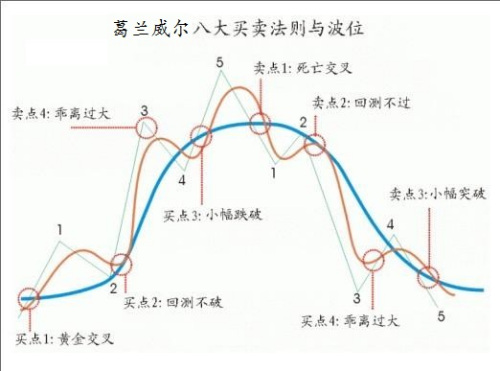

# JulWeek4
## 本周预期
1. 找到rankic大于0.025的因子
2. 将目前的挖掘因子方法模块化，方便复用
## 0721 请假
## 0722
### 构造思路 参考聚宽的日频因子的构建方法，构建1min频因子，并且评估。<br>
1. 收益率方差(5min,10min,15min,20min): std_rtn_vwap + [5,10,15,20]
2. 成交额的平均值(5min,10min,15min,20min): volume_avg_amt + [5,10,15,20]
3. 成交额的标准差(5min,10min,15min,20min): std_volume_amt + [5,10,15,20] 
### 结果（rankic绝对值大于0.015的）

| 因子名                                 | overall rankic |
|:---------------------------------------|:---------------|
| avg_AMT_15                             | -0.015124      |
| std_rtn_vwap_10                        | -0.015216      |
| sign_log_rtn_vwap_AMT                  | -0.015413      |
| avg_AMT_10                             | -0.015737      |
| std_AMT_5                              | -0.015847      |
| avg_AMT_5                              | -0.015944      |
| std_AMT_20                             | -0.016554      |
| std_AMT_15                             | -0.017210      |
| std_rtn_vwap_5                         | -0.017346      |
| std_AMT_10                             | -0.017719      |
同时做出cum_icir图，发现sign_log_rtn_vwap_AMT的cum_icir是单调递减的，overall rankic>0.015，而其他因子存在波动。<br>
### 因子的提交
使用这个库：https://github.higgsasset.com/Shannon/shannon_kbar_factor 

### 金融学里的统计常识
1. 不同种类的票，它们的volume和amount的分布是不同的，不能直接比较。
常见的处理方式是对于vol变化为vol/sharefloat，即计算成交量/流通股本的比率，换手率；同理对于amt有类似变化。
2. 由于预测的y为10min后的vwap的收益率，在金融中收益率一般是一个0均值的随机变量，有点类似正态分布，但是存在厚尾和尖峰。
因此在计算因子x时，我们希望因子x不能有离群点，或者说尽可能让x的分布接近y，常见处理有x**0.5, log(1+x), tanh(x)等。
关于成交量的有关知识可以[参考](https://xueqiu.com/1015812066/224221944)
### 真东西
1. 石川的因子投资讲的没问题，但是做的是日频，大家都卷，可以做分钟频的。
2. 散户需要剑走偏锋，小体量灵活，去北交所。
3. 做期货，但是不要上杠杆。
4. 

## 0723 & 0724 
### 提交/生成因子的库
因子提交使用的库没有readme文件，需要自己看一下怎么使用，可以参考逐笔成交的库 https://github.higgsasset.com/Shannon/shannon_innovation：
在此间出现问题：在vscode（pycharm可能也有）中，当前目录下的a.py文件需要调用../../pack/b.py文件时，
```
from pack.b import *
```
[参考](https://blog.csdn.net/weixin_39278265/article/details/119661991) <br>
报错ModuleNotFoundError: No module named 'pack'。解决方案是添加当前目录到sys.path中。<br>

## 0725
### 因子挖掘
使用vol/sharefloat和amt/sharefloat的方式来处理成交量和成交额。<br>