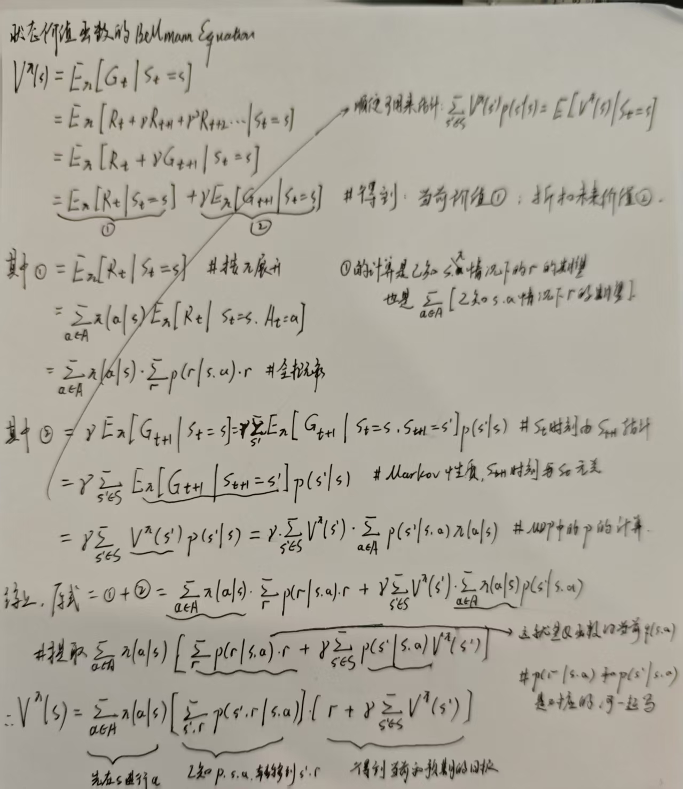
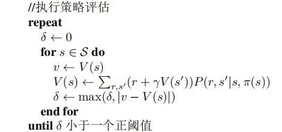

# 强化学习有关整理，[参考这里](https://hrl.boyuai.com/)
因为这个网站全的，所以这里只整理关键部分
## 1. 强化学习基础
### 1.1 马尔可夫性质
- 马尔可夫性质：当且仅当某时刻的状态只取决于上一时刻的状态时，一个随机过程被称为具有马尔可夫性质（Markov property），写作$P(S_{t+1}|S_t,S_{t-1},...,S_0) = P(S_{t+1}|S_t)$。  
- (可能问)马尔可夫性质说明当前状态和历史状态没关系吗？ 不是，虽然t+1时刻的状态只与t时刻的状态有关，但是t时刻的状态其实包含了{0,1,2,...,t}时刻的状态的信息，通过这种链式的关系，历史的信息被传递到了现在.
### 1.2 马尔可夫决策过程 MDP
MP：只有状态和转移概率 -> MRP:状态，转移概率，和转移之后获得的奖励 ->MDP  
MDP引入了动作的概念，让S之间的转换不仅仅是随机的，而是可以通过Agent选择动作来影响的。 因此一个MDP可以用一个五元组$(S,A,P,R,\gamma)$来表示，其中S为状态空间，A为动作空间，P为状态转移概率，R为奖励函数，$\gamma$为折扣因子。  
## 2. 基于价值的方法
### 2.1 价值函数、状态价值函数和Q函数
价值函数： 
$ V(s) = E[G_t|S_t = s] = E[R_t+ {\gamma}R_{t+1} + {\gamma}^2 R_{t+2}... |S_t = s] $  
$      = E[R_t+ {\gamma}R_{t+1} + {\gamma}^2 R_{t+2}... |S_t = s] $ 
$      = E[R_t+ {\gamma}G_{t+1}|S_t = s] = E[R_t+ {\gamma}V(S_{t+1})|S_t = s] $ 
于是可以得到t时刻s状态下的价值 = t时刻回报的期望 + 折扣后的，已知s状态发生的，下一个状态的价值期望。  
$ V(s) = r(s) + \gamma \sum_{s' \in S}p(s'|s)V(s') $
即 在状态s下得到的期望回报 + 未来整个采样轨迹下的折扣值的期望回报。  
- 个人理解1 对于价值函数 首先这个就是下面的bellmann方程，其次公式的第二项也就是未来期望的计算方式各有不同，就对应着DP,MC,TD等不同的价值估计方法
- 个人理解2 第二项的链式乘法和求算策略梯度时的链式乘法本质都是马尔可夫性质的体现。

状态价值函数：$V^{\pi}(s) = E_{\pi}[G_t|S_t = s]$，即在状态s下，按照策略$\pi$执行动作，得到的期望回报。  
动作价值函数/Q函数：$Q^{\pi}(s,a) = E_{\pi}[G_t|S_t = s, A_t = a]$，即在状态s下，执行动作a，得到的期望回报。  
很容易发现其实它们的关系：s状态的$V^{\pi}(s)$等于s状态下所有动作的Q值的加权平均，权重为策略$\pi$：  
$V^{\pi}(s) = \sum_{a \in A} \pi(a|s)Q^{\pi}(s,a)$  

### 2.2 Bellman方程
**Bellman方程：一个状态的价值函数等于该状态的立即回报加上下一个状态的价值函数的折扣值。**  
$V^{\pi}(s) = E_{\pi}[R_{t+1} + \gamma V^{\pi}(S_{t+1})|S_t = s]$  
可以写作矩阵形式：$V^{\pi} = R^{\pi} + \gamma P^{\pi}V^{\pi}$，其中$R^{\pi}$为立即回报，$P^{\pi}$为状态转移概率。  
由矩阵形式可以得到Bellman方程的解，在小范围的时候可以这样直接求解，复杂度是O(n2)，大规模求解参见下一节三类方法： 
$V^{\pi} = (I - \gamma P^{\pi})^{-1}R^{\pi}$  
价值函数和的Bellman期望方程：  
$V^{\pi}(s) = E_{\pi}[R_{t+1} + \gamma V^{\pi}(S_{t+1})|S_t = s] = \sum_{a} \pi(a|s) \sum_{s',r} p(s',r|s,a)[r + \gamma V^{\pi}(s')]$  
Q函数的Bellman方程：  
$Q^{\pi}(s,a) = E_{\pi}[R_{t+1} + \gamma Q^{\pi}(S_{t+1},A_{t+1})|S_t = s, A_t = a] = \sum_{s',r} p(s',r|s,a)[r + \gamma \sum_{a'} \pi(a'|s')Q^{\pi}(s',a')]$  
[**V 的贝尔曼方程推导**](https://zhuanlan.zhihu.com/p/688029400),常看，容易被拷打 
  

### 2.3 蒙特卡洛法、动态规划法、时序差分法(可以参考[这里](https://zhuanlan.zhihu.com/p/670031458))
这三种方法是简单的价值函数估计方法(不算穷举的话)，它们本质都是为了计算出$V(s)$ 和$Q(s,a)，一样的，下面我只写V的  
**蒙特卡洛法**：通过采样的方法，估计状态的价值函数。通过采样轨迹，计算每个状态的回报，然后求平均值。  
**动态规划法**：通过Bellman方程迭代求解价值函数。利用动态规划的思想，将问题分解为子问题，逐步求解。动态规划包括策略迭代和价值迭代。  
**时序差分法**：通过采样的方法，估计状态的价值函数。通过采样轨迹，计算每个状态的回报，然后用下一个状态的价值函数估计值替代。  
三种方法都是为了解决Bellman方程的求解问题，其中动态规划法需要知道环境的完全信息（状态转移概率和回报），蒙特卡洛法和时序差分法只需要Agent和环境的交互数据，前者是纯采样估算，后者相当于下探一步。  
从状态转移树的角度看，在$s_t$状态节点，动态规划法完整地计算出下一层的所有节点，蒙特卡洛法选中一个节点并且下探到最底层，时序差分法选中一个节点并且下探一层。三种方法在更新价值函数时的对应更新策略如下：  

#### 1. 穷举法和蒙特卡洛法： 
$V^{\pi}(s) = E_{\pi}[G_t|S_t = s]$ 直接采样N条轨迹，那么 $V^{\pi}(s) = 1/N \sum_{i=1}^{N} G_t^i$  
当然也可以用增量式更新：$N(t) += 1; V(s_t) = V(s_t) + 1/N(t)(G_t - V(s_t))$ 其中Nt是当前采样条数  
蒙特卡洛法的更新方式是免模型的，因为它不需要知道状态转移概率和回报函数，只需要采样轨迹；对于陌生的环境，在不知道状态转移概率和回报函数的情况下，蒙特卡洛法是最简单的价值函数估计方法。  

#### 2. 动态规划法： 
动态规划法是一类强化学习方法，和算法里的DP很像，都是解决问题首先要解决子问题。动态规划分为策略迭代和价值迭代。 
**(1)策略迭代**： 
策略迭代会交替进行策略评估和策略提升，其中策略评估会用到**动态规划的思想来估算价值函数**，策略提升则是通过贪婪策略来更新策略。 
策略评估 Policy Evaluation: 根据Bellmann方程$V^{\pi}(s) = \sum_{a} \pi(a|s) \sum_{s',r} p(s',r|s,a)[r + \gamma V^{\pi}(s')]$，若已知状态转移函数p(s',r|s,a)和下一个状态的价值函数V(s')，则可以计算出当前状态的价值函数V(s)。 
* （如果环境完全已知（已知P和R),那么上式有|S|个线性方程，解|S|个未知数V(s)，理论上是可以直接求解的。）  

因此可以将计算V(s')看作子问题，V(s)看作原问题，当然V(s')的计算又依赖于更下一级的状态价值函数V(s'')，因此可以递归地计算V(s)直到收敛。
在实际操作的时候这样会造成巨大时间开销，因此可以使用迭代的方式，对于每个状态S，选定任意初始值 $V_0$,不断迭代更新 $V_{k+1}(s) = \sum_{a} \pi(a|s) \sum_{s',r} p(s',r|s,a)[r + \gamma V_k(s')]$ 直到收敛，即每一步k+1都用上一步k计算得到的*V*来更新当前的*V*（收敛到不动点就是$V_{\pi}(s)$）。 
策略提升 Policy Improvement: 根据当前的价值函数V(s)，更新策略$\pi$，使得在每个状态s下选择的动作a是贪婪的，即选择使得Q(s,a)最大的动作。 
策略提升之所以可以确保收敛是因为 **策略提升定理** 

   
**(2)价值迭代**

#### 3. 时序差分法： 

### 2.4 时序差分法中的Sarsa和Q-learning，两种免模型的强化学习方法
时序差分法是一种在线学习方法，不需要等到一个完整的轨迹结束，就可以更新价值函数，如上所述时序差分的更新目标为：$V(s_t) = V(s_t) + \alpha(R_{t+1} + \gamma V(s_{t+1}) - V(s_t))$  
其中$(R_{t+1} + \gamma V(s_{t+1}) - V(s_t))$被称为TD Error，表示当前状态的估计值和下一个状态的估计值之间的差异。 **这个要记住，因为后面一堆算法本质就是在改来改去这个TDE。**  
**Sarsa**：在线，更新目标为：$Q(s_t,a_t) = Q(s_t,a_t) + \alpha(R_{t+1} + \gamma Q(s_{t+1},a_{t+1}) - Q(s_t,a_t))$  
**Q-learning**：离线，更新目标为：$Q(s_t,a_t) = Q(s_t,a_t) + \alpha(R_{t+1} + \gamma \max_{a}Q(s_{t+1},a) - Q(s_t,a_t))$  
从更新目标看出，**在t时刻，两者更新TD Error方式不同，本质是两者对于t+1状态的Q估计不同**。Sarsa是用下一个状态的动作a'的Q值来更新，Q-learning是用下一个状态的最大Q值来更新。Sarsa用了a'更新，在下一个阶段一定会用a'来采样；Q-learning更新用的a和下一步选择的a无关，选择动作是根据argmax Q来选择的。  
Q-learning的更新方式是离线的，因为它不需要等到下一个状态的动作，而Sarsa是在线的，因为它需要等到下一个状态的动作，sarsa的更新需要<s,a,r,s',a'>, Q-learning只需要<s,a,r,s'>。  
### 2.5 D3QN
D3QN是Q-learning的一步到位版本，Double Dueling DQN，目前解决离散问题的sota。这里简介其中的思路。  
1. Q网络化：表格类学习方法不适合巨大多空间，因此需要一个网络来逼近Q函数。  
2. 记Q网络的参数为$\theta$，参考Q学习的更新目标为：$Q(s_t,a_t) = Q(s_t,a_t) + \alpha(R_{t+1} + \gamma \max_{a}Q(s_{t+1},a) - Q(s_t,a_t))$  
3. 于是Q网络的更新目标为：$(\theta)^* = 1/2N \arg \min_{\theta} \sum_{i}(Q(s_t,a_t;\theta) - (R_{t+1} + \gamma \max_{a}Q(s_{t+1},a;\theta^-) - Q(s_t,a_t;\theta))^2$,这就是深度Q网络
4. 为了稳定训练防止Q的过度估计，Double Q-learning，具体是维护两个Q网络，称为目标网络$Q^-$和估计网络$Q$，估计网络用来选择动作，目标网络用来计算TD Error。每隔C轮更新一次目标网络的参数，即$\theta^- = \theta$。  
5. 优势函数$A(s,a) = Q(s,a) - V(s)$，表示在状态s下选择动作a的优势，后面的Actor-Critic方法也会用到优势函数思路。  
6. Dueling DQN，将Q网络分为两个部分，一个是状态价值函数V，一个是优势函数A，最后的Q函数为$Q(s,a) = V(s) + A(s,a)$，将Q函数分解为状态价值函数和优势函数，可以关注一些不考虑动作只考虑状态的场景。  
7. DQN中的buffer机制，用于存储交互数据，每次从buffer中采样一批数据进行训练，这样可以减少样本间的相关性，提高训练效率。由于使用buffer所以DQN是off-policy的。  
## 3. 基于策略的方法
机遇价值的方法通过学习价值函数，再根据价值函数选择argmaxQ的动作，这种方法称为基于价值的方法，不存在一个显式的策略。而基于策略的方法直接学习策略。
### 3.1 策略梯度 Policy Gradient
考虑一个策略$\pi(a|s;\theta)$，其中$\theta$为策略参数，表示在状态s下选择动作a的概率。策略梯度的目标是最大化回报的期望，即最大化$J(\theta) = E_{\pi}[G_t]$。  
为了最大化这个目标，可以使用梯度上升法，即$\theta = \theta + \alpha \nabla_{\theta}J(\theta)$，其中$\nabla_{\theta}J(\theta) = E_{\pi}[\nabla_{\theta} \log \pi(a|s;\theta) Q(s,a)]$。   
[策略梯度优化目标的证明](https://hrl.boyuai.com/)，观察上式，可以看出策略梯度的更新修改方向是尽可能选取回报高的动作，这样可以提高回报的期望。同时策略更新使用的数据来自于本轮的交互数据，因此策略梯度是在线学习方法。  
* REINFORCE算法：PG在更新策略时需要获取Q(s,a),可以使用多种方式进行估计，比如使用MC方法，这就是REINFORCE算法。  
REINFORCE的伪代码如下；  

Initialize $\theta$  
for each episode {  
    Generate an episode $\{s_0,a_0,r_1,s_1,a_1,r_2,...,s_T\}$ using $\pi(\cdot|\cdot;\theta)$  
    for t = 0 to T-1 {  
        $\theta = \theta + \alpha \nabla_{\theta} \log \pi(a_t|s_t;\theta) G_t$  
        其中$G_t = \sum_{k=t}^{T-1} \gamma^{k-t}r_{k+1}$ 即当前时刻向后的回报  
    }  
}  
* 以REINFORCE为代表的on-policy方法因为策略更新的优化目标是当前策略期望回报，因此总能保证局部最优解（因为得到的是无偏的梯度），但是由于是on-policy方法，**因此会有较大的方差，训练不稳定**。  

### 3.2 Actor-Critic，
AC算法融合了基于价值和基于策略的方法，同时学习价值函数和策略函数。在前述的计算Policy Gradient过程中，使用了价值函数的估计值，即$\nabla_{\theta}J(\theta) = E_{\pi}[\nabla_{\theta} \log \pi(a|s;\theta) G_t]$。  
这里的$G_t$可以有多种形式，REINFORCE中是：$G_t = \sum_{k=t}^{T-1} \gamma^{k-t}r_{k+1}$ 即当前时刻向后的回报。可以使用各种版本: 
* $G_t = Q(s_t,a_t)$，$G_t = A(s_t, a_t)$ 利用Q函数或者优势函数来估计回报。  
* $G_t = \sum_{k=0}^{\infty} \gamma^k r_{t+k+1}$，使用MC方法来估计回报,但是是一整条轨迹的（这样就变成off-policy）。  
* $G_t = r_{t+1} + \gamma V(s_{t+1}) - V(s_t)$，使用TD Error来估计回报。  
* $G_t = \sum_{k=t}^{T-1} \gamma^{k-t}r_{k+1} - b(s_t)$，带基线函数的估计，用于减小方差。  
AC算法采用TDE来作为价值网络$\omega$的更新目标，这样的好处是在更新梯度的时候，损失函数为：$L(\omega) = 1/2 (r_{t+1} + \gamma V(s_{t+1}) - V(s_t))^2$，这样写在求梯度时可以将$r_{t+1}+V(s_{t+1})$看作目标，只需要算$V(s_t)$的梯度。
AC算法的伪代码如下：  
* Initialize $\theta, \omega$  
* for each episode {  
    Generate an episode $\{s_0,a_0,r_1,s_1,a_1,r_2,...,s_T\}$ using $\pi(\cdot|\cdot;\theta)$  
    for t = 0 to T-1 {  
        $G_t = \sum_{k=t}^{T-1} \gamma^{k-t}r_{k+1}$  
        $\delta = r_{t+1} + \gamma V(s_{t+1}) - V(s_t)$  
        $\omega = \omega + \beta \delta \nabla_{\omega}V(s_t)$  
        $\theta = \theta + \alpha \nabla_{\theta} \log \pi(a_t|s_t;\theta) G_t$  
    }  
}  
* 关于上述两行中的梯度更新具体的推断：
* $\omega$的更新：$L(\omega) = 1/2 (r_{t+1} + \gamma V(s_{t+1}) - V(s_t))^2$，$\nabla_{\omega}L(\omega) = (r_{t+1} + \gamma V(s_{t+1}) - V(s_t))\nabla_{\omega}V(s_t) = \delta \nabla_{\omega}V(s_t)$，这里的$\delta$是TD Error，引入之后可以将$r_{t+1}+V(s_{t+1})$看作目标，只需要算$V(s_t)$的梯度，和深度学习反向传播定义残差$\delta$的思路一样。
* 关于Actor-Critic里谁重要：PPO可以没有V，但Q-Learning 不能没有Q
* 1）PPO的本质是Policy Gradient，V是辅助。 V只是一个动态的优势函数的baseline，去掉V的典型代表就是GRPO ，完全OK。
* 2）SAC 这类 offpolicy + Q-Learning 的方法，需要拟合最优动作价值函数，Q是核心。 在SAC中，Q的最优性由Policy承担。而在一般的离散Q-Learning中，有时往往不需要Policy，仅借助Q也可以进行动作决策。

### 3.3 [TRPO， PPO ， DDPG](./rl_trpo.md)
PG和AC方法在更新策略时，使用的是梯度上升法，当网络深度增加，这样的方法在更新时可能不稳定，Trust Region Policy Optimization(TRPO)则限制策略在“信任区间”内更新，在此区间内的更新可以保证策略稳定改善。  
TRPO的推导过程：
1. TRPO的主要思想是在更新策略时，保证新策略和旧策略的KL散度在一个范围内，假设当前策略的参数为$\theta$，新策略的参数为$\theta'$，则两个策略的优化目标分别为：$J(\theta) = E_{s_0}(V^\pi(s_0))$, $J(\theta') = E_{s_0}(V^{\pi'}(s_0))$
2. 将优化目标作差，得到：$J(\theta') - J(\theta) = E_{s_0}[(V^{\pi'}(s_0) - V^{\pi}(s_0))] = E_{\pi_{\theta'}}(\sum_{t=0}^{\inf}\gamma^t(r_t + \gamma V^{\pi_{\theta}}(s_{t+1}) - V^{\pi_{\theta}}(s_t)))$,期望内求和的部分是TD Error，即新策略和旧策略的回报差异，可以被进一步定义为优势函数$A^{\pi_{\theta}}(s,a)$
3. 但是观察上式会发现，$\pi_{\theta‘}$是需要求解的策略，但是计算优化目标时又用到了，这不好，因此需要近似处理，直接用旧策略$\pi_{\theta}$来估计新策略的回报，即$J(\theta') - J(\theta) = E_{s_0}[(V^{\pi'}(s_0) - V^{\pi}(s_0))] \approx E_{s_0}[(V^{\pi}(s_0) - V^{\pi}(s_0))] = E_{\pi_{\theta}}(\sum_{t=0}^{\inf}\gamma^t(r_t + \gamma V^{\pi_{\theta}}(s_{t+1}) - V^{\pi_{\theta}}(s_t))) = E_{\pi_{\theta}}(A^{\pi_{\theta}}(s,a))$
4. $ J' - J = E(A), J' = J + E(A)$ 就是新的优化目标，E(A)上面的简写，可以化为$ 1/(1-\gamma)E_{\pi_{\theta}}(A^{\pi_{\theta}}(s,a))$,因此只要保证E(A)>0,就可以保证策略单调递增。
5. 但是直接用旧策略是有估计误差的，在计算$E_{\pi_{\theta}}(A^{\pi_{\theta}}(s,a))$时，会有估计误差，因此需要引入KL散度，限制新策略和旧策略的差异,EA被改写为$E_{s_V^{\pi_\theta}}E_{a_{\pi_\theta}}(A^{\pi_{\theta}}(s,a)) \approx E_{s_V^{\pi_\theta}}E_{a_{\pi_\theta}}(KL(\pi_{\theta}(\cdot|s),\pi_{\theta'}(\cdot|s))$，其中$KL(P,Q)$表示P和Q的KL散度，即两个分布的相对熵，等于P和Q的交叉熵减去P的熵，计算方式为$KL(P,Q) = \sum_x P(x) \log \frac{P(x)}{Q(x)}$
6. TRPO的优化目标为$J(\theta') = J(\theta) + E_{s_V^{\pi_\theta}}E_{a_{\pi_\theta}}(KL(\pi_{\theta}(\cdot|s),\pi_{\theta'}(\cdot|s))$，约束条件为：$E_{s_V^{\pi_\theta}}E_{a_{\pi_\theta}}(KL(\pi_{\theta}(\cdot|s),\pi_{\theta'}(\cdot|s)) \leq \delta$.
7. 求解上述优化问题使用KKT条件。
由于LLM和强化学习的结合，此节这三类方法重新详细整理了一下。在标题超链接内。