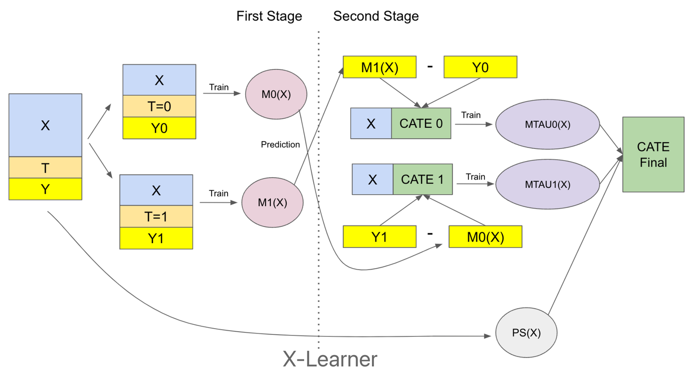

此文为关于因果推断的进一步补充内容。这个版本更简洁，适合速成。

# 1.因果推断目的
因果推断目的是估算两个效应，群体的ate，个体的ite。 由于在实际中个体ite无法直接观测，以前者为主。 
在treatment分组很多时，无法通过简单加权得到ate，引入倾向性得分概念：$\pi{x} = P(T=1|X=x)$  
倾向性得分可以用来做人群的分层，常见思路有PSM(倾向性匹配), DR, IPW(逆倾向性加权)等，
- PSM: 一般先用倾向性得分分层，每层之内可以看作是同质（无混淆因素）的，再对层做加权平均得到ate。（这里有一个技巧，避免极端样本干扰，做倾向性匹配通常选用 propensity score在 [0.5, 0.95] 区间的个体） 
- IPW：PSM过于粗糙，IPW对每个个体之间按照倾向性得分做加权，$\hat{ATE} = \frac{1}{N}\sum_{i=1}^{N}(\frac{T_iY_i}{\pi(X_i)} - \frac{(1-T_i)Y_i}{1-\pi(X_i)})$  直观看就是treatment的分配非完全随机选择的，那么根据他们进入各组的概率进行调整。

# 2.几种meta-learning快速一览
## s-learner 单模型
最简答粗暴的方式，将X和T作为特征，直接训练一个模型，预测$Y_i = F(x_i)$。然后直接估算ite ate： 
$ ITE = Y_i(1, x_i) - Y_i(0, x_i) $  
$ ATE = \frac{1}{N}\sum_{i=1}^{N}ITE_i $  
存在问题：1、如果特征X的维度远高于T，T会被淹没。 2、c-t组差异过大/有偏时，无法有效学习。
## t-learner 双模型
思路是用两个模型分别处理treatment和control组，所有t=1的数据训练$ F_1(x)$，所有t=0的数据训练$F_0(x)$，然后预测$Y_i(1, x_i) = F_1(x_i)$，$Y_i(0, x_i) = F_0(x_i)$，然后计算ite ate。 
存在问题：1、如果存在大量随机无偏数据，没问题 2、T-Learner无法解决 selection bias问题，导致预估的因果效应可能会存在很大的偏差 3、两个学习器导致可能方差大。
## x-learner 交叉模型
此模型为许多深度因果模型的参考，原理图如下 
 
- step1，先训练两个学习器，同t-learner，得到$F_1(x)$和$F_0(x)$  
- step2，构造pseudo_outcome，$D_1 = Y_i - F_0(x_i)$，$D_0 = F_1(x_i) - Y_i$；这两个伪结果实现了数据的交叉，解决了selection bias问题，其含义为，d1:“如果收到干预的样本没被干预会如何，这是一个伪uplift“，d0同理。 
- step3，训练两个新的学习器$G_1(x)$和$G_0(x)$，分别在t=1数据拟合$D_1$，t=0数据拟合$D_0$，相当于学习残差。 
- step4，计算ite ate，$ITE = g(x)G_1(x) + (1-g(x))G_0(x)$，$ATE = \frac{1}{N}\sum_{i=1}^{N}ITE_i$， 其中g(x)是调节权重的，原论文说用倾向性得分最好 
## r-learner 残差模型
把因果推断模型改写为loss优化问题。首先对于个体而言，有：
$E [Y_i(T) - [\mu_0(X_i) + T_i(\tau(X_i))]] =E[\epsilon_i] $  
即某个体在干预t下的结果y1 == 无干预结果y0+干预效应*个体干预ite。也就是说上述的残差的期望应该是0. 
定义conditional mean outcome $m_0(X_i) = E[Y_i|X_i] = \mu_0(X_i) + \pi(X_i)\tau(X_i)$，即在没有干预的情况下，个体的期望结果。 
上述两个做差，可以得到 
$E[Y_i - m_0(X_i)|X_i] = E[T_i -\pi(X_i)|X_i]\tau(X_i)$ 
去掉期望项把残差暴露出来： 
$Y_i - m_0(X_i) = (T_i -\pi(X_i))\tau(X_i) + \epsilon_i$ 
在已知m(), pi()的情况下，就可以使用优化loss的方式，最小化关于残差的loss来学习预估函数$\tau()$，即个体干预效应,很直观的融到机器学习里了。 
缺点是如果m()和pi()的学习器不行，预估不准，残差会很大，导致学习的$\tau()$不准。

# 3.离线评估方法
模拟数据集有真实ground truth的ite和ate，可以直接计算误差mae_ate 和pehe，即ate集记的损失，比较直观。 
在真实数据集上，无法直接计算误差. 在rct条件（treatment随机）下，评价指标如下：
## mae—att
att(average treatment effect on the treated)是treatment组的平均干预效应，计算公式为：
$ATT = \frac{1}{|T|}\sum_{i \in T}{Y(i)} - \frac{1}{|C|}\sum_{i \in C}{Y(i)}$ 
mae-att是预估的att和真实att的误差，计算公式为： $MAE_{ATT} = |\frac{1}{|T|}\sum_{i \in T}\tau_(i)- ATT|$ 
mae_att越小表明对treatment组的干预效应预估越准确。 
## qini系数和auuc 略，(可参考)[https://zhuanlan.zhihu.com/p/627342229]