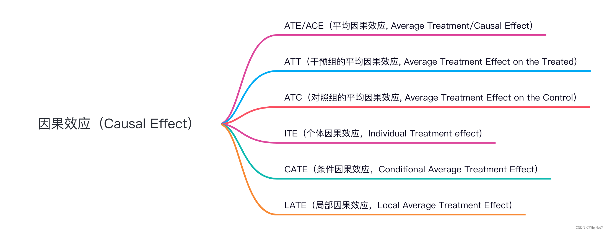
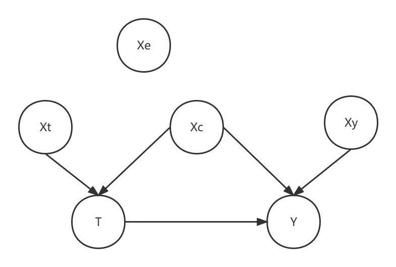
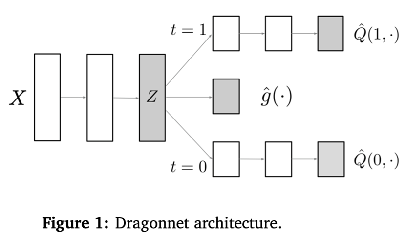

### 学习关于多treatment的uplift模型 [此篇文章](https://zhuanlan.zhihu.com/p/13394677406)
Meta-learner：将treatment作为特征（S-learner）、或根据不同的treatment搭建多个模型（T-learner），这个已有许多py包可以实现。 
[TarNet](arxiv.org/abs/1810.00656) 提到了使用CFRNet/TarNet对多treatment进行建模，共享层表征X后，根据treatment的个数分到多头。 
[DRNet](arxiv.org/abs/1902.00981) 提到了对于连续treatment的建模方法，DRNet是一个二维、多值干预模型，常用场景为“给一个用户发什么类型的优惠券、发券金额是多少”的二维多值干预。 

### uplift基础概念
1. uplift的定义 && 矛盾的目标  
Uplift models用于预测一个treatment的增量反馈价值，也就是lift的部分。 
由于不能同时观测到对同一个用户对这两个值和（一个用户无法同时被干预+不干预），可以通过子人群的增益效果来推断个体的增益效果。 
2. uplift的几个重要概念  
Uplift是Causal Inference的一个应用，通过计算cate（conditional average treatment effect）来估计ite（individual treatment effect）。记$Y_1$,$Y_0$为用户收到影响/不收到影响下的outcome。  

* 因果效应uplift/个体的ite：$U = E[Y_1 - Y_0]$，即treatment和no treatment下的outcome的差值。可以表示treatment的增量价值。 
* 用户实际被观测到的outcome：$ Y = Y_1 * T + Y_0 * (1 - T)$, 其中$Y_1$是treatment下的outcome，$Y_0$是no treatment下的outcome，$T$是treatment的0-1指示变量。 
* 条件独立假设（CIA）：$Y_1 \perp Y_0 | X$，即在给定X的条件下，treatment和outcome是独立的（用户被分到实验组还是对照组和用户本身无关） 
* 在CIA成立情况下，可以估算总体中子人群被干预的因果效应期望cate：$U = E[Y_1] - E[Y_0] = E[Y_1|X] - E[Y_0|X] = E[Y|X,T=1] - E[Y|X,T=0]$,即uplift等于实验组平均值和对照组平均值的差。 
* 倾向分Propensity Score：$P(X) = P(T=1|X)$，即在给定X的条件下，用户被分到实验组（被干预）的概率。 

3. Uplift Modeling  
建模思路大致分为三种： 
(1). 双模型：建立两个对于outcome的预测模型，一个在实验组数据一个在对照组数据。（T-learner）（以及它的变体X-learner） 
通常作为baseline方法，对$E[Y_1|X]$,$E[Y_0|X]$分别建模，对于每一个用户做差计算出uplift。优点简单易用；缺点没有直接对uplift建模。  
(2). class transoformation method：适用于Y是二分类的情况。（S-learner） 
对于单个用户i，构造目标函数$ Z_i = {Y_i}^{obs} * T_i +(1 - {Y_i}^{obs}) * (1 - T_i)$，即在实验组下的outcome和对照组下的outcome的期望差。 
满足条件 $p(x_i) = P(T=1|X_i) = 1/2 $ 时，uplift可以被表示为：$ U = E[Y_1|X] - E[Y_0|X] = P(Z = 1|X)- P[Z=0|X =  P(Z = 1|X) - (1 - PC[Z=0|X]) = 2* P(Z = 1|X) - 1$  
缺点：需要满足两个假设——1. 二分类场景，2. 数据在实验/对照组的分布一致，较为严格。可以拓宽到样本不均衡分布（倾向分不为1/2）的情况。  
此时cate可以被写为： $Y_i =  \frac{Y_i(1) * T_i }{P(T=1|X_i)} + \frac{Y_i(0) * (1 - T_i)}{1 - P(T=1|X_i)}$，即在实验组下的outcome和对照组下的outcome的期望差。 
(3). 直接建模：直接对uplift进行建模。 
uplift树模型Tree-Based Method，可以处理二分类treatment，改进方法使用cts(contextual treatment selection)可以处理多分类的treatment。 
深度学习模型，直接对uplift建模。 

4. 四种meta-learner方法详细介绍  
(1). T-learner  
简介：差分响应模型，Two-model learner：先对于T=0的control组和T=1的treatment组分别学习一个有监督的模型。control组模型只用control组的数据，treatment组模型只用treatment组的数据。 
原理：control组学习出的模型输出为 $u_0(x) = E[Y_0|X=x]$，treatment组的为 $u_1(x) = E[Y_1|X=x]$。 
最终预测的uplift为 $U(x) = u_1(x) - u_0(x)$。 
优点是原理简单，分组后分别拟合即可，缺点是误差累积，对response建模后做差得到的uplift，只能用于离散treatment。 
(2). S-learner  
简介：Single-model， 将treatment也作为一个特征输入到模型中，直接对uplift进行建模。 
原理：训练一个机器学习模型，输出 $u(x) = E[Y|X=x, T=t]$ ,模型直接建模的还是response值，然后间接求出uplift $U(x) = u(x,T=1) -u(x,T=0) $。 
优点是没分组，数据利用充分，缺点是还是间接建模uplift，且特征列X和treatment维度差距过大容易学崩。 
(3). X-learner  
简介：类似T-learner的小变体。 
原理：先对treatment组和control组分别建模，得到 $u_1(x) = E[Y_1|X=x]$ 和 $u_0(x) = E[Y_0|X=x]$。（这步和T-learner一样） 
得到两个模型后，分别计算control组和treatment组的diff：${D_i}^{1} = {Y_i}^1 - u_0({x_i}^1)$ 和 $D_i^{0} =u_1({x_i}^0)-{Y_i}^0$。注意这里出现的交叉，diff表示组内预测值和实际值的差。 
再用两个机器学习模型来拟合这两个diff，得到 $d_1(x) = E[D^{1}|X=x]$ 和 $d_0(x) = E[D^{0}|X=x]$。 
最后的uplift预测为 $U(x) = p(x) d_0(x) +(1-p(x)) d_1(x)$。p(x)是倾向分，注意这里又交叉一次。  
(4). R-learner  
原理：和dml类似，可以看作是原始的dml（如果看了causalml库的源码会发现，这个库里的dml是继承的R-learner） 
5. [uplift evaluation](https://blog.csdn.net/JESSIENOTCAR/article/details/132625380)  
uplift评估最大的难点在于我们并没有单个用户uplift的ground truth，因此传统的评估指标像AUC是无法直接使用的。 
* auuc（area under uplift curve）是uplift模型的评价指标。 
* 第k个Uplift值的含义是：根据uplift score值从大到小对数据集D排序，即score值高的排在前面，前k个人中实验组平均产生的价值-前k个人中空白组平均产生的价值。依次类推，我们可以得到第1~n个Uplift值，可以根据此画出曲线。

* ite 个体提升效果，对同一个对象，处理和不处理，outcome的差值，**不可观测的，一个人不能既要又要**。$ \tau_i = Y_i(T=1) - Y_i(T=0)$
* ate 平均提升效果，收到/不收到处理的outcome的差值，是一种估计；可能存在其他混淆变量导致两个组outcome有差异，因此存在偏差 $ate = E[Y|X=1] - E[Y|X=0]$
* att/atc 平均处理效果/平均控制效果，关注一部分对象，$ \tau_{att} = E[|Y_i(T=1) - Y_i(T=0)|T=1]$, atc同理  
* cate 条件平均处理效应，$\tau_{cate} = E[Y(1) - Y(0) | X=x]$
* 三组关系： $ate = E[ite] $

### TARNet 

### Dragonnet 
#### dragonnet的核心思路
传统的因果推断通过划分C/T组，计算得到两组间的插值进行估算 $U(x) = u_1(x) - u_0(x)$ 存在的问题是可能造成偏差。 
因此做出如下改进点：（1）用深度网络寻找潜在的隐变量特征，避免出现 $u_1(x) - u_0(x)$ 之间的偏差；（2）输入不需要是所有变量。 （3）单纯训练两个结果头（如 TARNet）可能导致过度拟合处理组的模式。 加入倾向得分头并通过针对性正则化（targeted regularization） ，可以在估计ATE/ITE 时提高渐近效率 
#### dragonnet的前置理论知识：Sufficiency of Propensity Score 
1. 如果ATE通过观测变量X来识别，那么ATE也可以通过倾向分P(T=1|X)来识别。用数学表述为： 
如果 $ Y(0), Y(1) \perp T | X$，那么 $Y(0), Y(1) \perp T | P(T=1|X)$。 
2. 特征X可以分为四类 $ X = (X_c, X_t, X_y, X_e)$， 如下图所示   
  
(1). $X_c$：confounder,混淆变量，又影响T又影响Y的变量，也是需要**全放到模型**中的变量  
(2). $X_t$：仅影响T的变量，放到模型会导致因果估计出偏差  
(3). $X_y$：仅影响Y的变量，**对模型精度有提升**  
(4). $X_e$：不影响T和Y的变量，应该剔除   
#### dragonnet的网络结构
